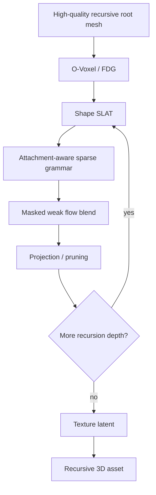

# 递归 3D 生成增长：综合研究判断与下一阶段路线

> [!info] 文档定位
> 这份文档不是实验流水账，而是基于当前已经完成的基础实验、Trellis2 工作流、视觉结果、代码资产、文献调研和原始 proposal 的综合研究判断。
>
> 关联文档：
> - 原始 proposal：`/Users/fanta/Downloads/recursive_3d_generative_growth_proposal.md`
> - 中文实验总览：[[递归3D生成增长_Trellis2实验进展总览_2026-05-07]]
> - AgentDoc 计划：`/Users/fanta/code/AgentDoc/PROJECTS/recursive_3d_generative_growth/plans/recursive_3d_generative_growth_ralph_plan_20260507.md`
> - 本机项目：`/Users/fanta/code/agent/Code/recursive_3d_generative_growth`
> - A100 项目：`/mnt/beegfs/ruocheng/recursive_3d_generative_growth_20260507`

## 1. 一句话研究判断

这个项目仍然值得继续做，但应该从“让 Trellis2 直接生成递归/分形结构”收敛为：

> **用传统或显式结构方法控制递归拓扑，用 Trellis2 的 O-Voxel / SLAT / flow 能力做局部自然化和材质补全。**

更具体地说，当前最有希望的研究路线是：

```text
high-quality root mesh
  -> O-Voxel / FDG
  -> shape SLAT
  -> recursive sparse-coordinate grammar
  -> weak/mid masked flow blend only on new growth
  -> decode
  -> component pruning / local remeshing
  -> texture latent
```

这个判断比原 proposal 更保守，但更扎实。实验已经说明 Trellis2 不能被当成“任意 scaffold 的万能解释器”，但它可以被当成 **native 3D latent naturalizer**。核心贡献应放在“如何把递归程序接入 frozen structured 3D generator 的原生空间”，而不是放在 prompt 或线稿条件上。

## 2. 现在已经比较确定的事实

### 2.1 正结果

1. Trellis2 在 `a100-2` 上已经跑通，DINOv3 官方条件路径、shape SLAT、texture latent、mesh encoder path 都已经有实验证据。
2. 正常 object-like image 输入下，Trellis2 能生成合理的 tree / vine / lattice-like 结构，说明模型本身和 DINOv3 权重路径没有根本问题。
3. `mesh -> O-Voxel / FDG -> shape_slat_encoder -> shape_slat_decoder` 能保留传统程序 mesh 的主体结构，这是项目中最重要的路线转折。
4. sparse SLAT coordinate 可以做 mirror / copy / fork / fork_side 等 rewrite，并且可以 decode，不会立刻全空间爆炸。
5. 完整 recursive grammar workflow 已经跑通：IFS、L-system、DLA root 都可以进入 shape SLAT grammar 并生成 depth 2/3 输出。
6. masked repair 和 blend repair 证明了 Trellis2 flow 可以作为局部 feature naturalizer，但最好只作用在新增坐标，且强度不能太大。
7. texture latent 可以接到最终 recursive candidate 上，说明 geometry 稳定后再做材质是可行的。
8. connected-component pruning 非常有效，能把 weak-blend 输出的上万个 floating components 降到十几个 retained components。

### 2.2 负结果

1. zero-condition Trellis2 不是可用 baseline，只能作为环境诊断。
2. handcrafted image feature proxy 是负结果：弱则空，强则爆，结构不保留。
3. 直接把 procedural scaffold 的点图/线稿喂给 DINOv3-conditioned Trellis2，通常得到薄片、碎片或 sheet。
4. 单纯增加 sampler steps 不会解决结构保真；IFS steps 8 比 steps 2 有更多 3D extent，但 fragmentation 更严重。
5. full flow repair 虽然更“生成式”，但容易把结构推成 blob/sheet。
6. image-entry root 的 artifact 会被后续递归继承；bad root 不能指望 masked repair 自动修好。

### 2.3 最关键的视觉证据

mesh-first 路径明显比 2D scaffold 条件稳定：

![[trellis2_mesh_first_reconstruct_contact_sheet_20260507_1745.png]]

程序线稿/点图的 DINOv3 输入不是主线：

![[trellis2_dinov3_min_ifs_steps_comparison_20260507_seed300.png]]

L-system recursive grammar 可以形成稳定递归增长：

![[lsystem_recursive_grammar_contact_sheet.png]]

full flow repair 有生成性，但 sheet/blob drift 明显：

![[recursive_flow_repair_contact_sheet.png]]

masked/blend repair 是当前最佳方法候选：

![[lsystem_procedural_blend_contact_sheet.png]]

image-entry root 的 sheet artifact 会被递归继承：

![[image_lsystem_warm_from_image_entry_contact_sheet.png]]

## 3. 原 proposal 中哪些东西值得继续

### 3.1 值得继续：Recursive Fractal Asset Growth

这是最值得继续的任务，也是目前唯一已经形成完整 baseline 的方向。

原 proposal 中的 Task 1 说要做 branching coral、tree roots、crystal clusters、leaf-vein-like sculptures 等 recursive natural assets。现在应把它改成两条子线：

1. **tree/root/bush line**：L-system / space colonization root，`fork` / `fork_side` grammar，masked weak blend。
2. **coral/crystal/porous cluster line**：DLA / voxel frontier root，`radial` / `side` grammar，masked repair 或 coordinate grammar。

当前 tree/root/bush line 更接近主论文；DLA line 更适合作补充 demo 或 stress test。

推荐继续的最小主线：

```text
L-system or space-colonization root mesh
  -> shape SLAT
  -> attachment-aware fork/fork_side grammar
  -> alpha 0.25/0.5 masked blend
  -> per-depth pruning
  -> final texture latent
```

### 3.2 值得继续但要改写：Grammar-as-Sampler

原 proposal 的 “Grammar-as-Sampler Program” 是正确的，但现在应从抽象 sampler program 改写为更具体的 sparse latent grammar：

```text
grammar does not draw final geometry
grammar rewrites sparse coordinate support
Trellis2 supplies local feature naturalization
projection/pruning stabilizes recursive state
```

这个表述和当前代码、实验都能对齐：

- `trellis2_recursive_slat_grammar_workflow.py` 已经实现 shape SLAT coordinate grammar；
- `trellis2_recursive_masked_repair_workflow.py` 已经实现 old feature preserve + new feature flow/blend；
- `mesh_quality_metrics.py` 和 `prune_mesh_components.py` 已经支撑 projection / stability 分析。

### 3.3 值得继续：Preservation-Naturalization Trade-off

原 proposal 中的 “Local Re-noise Preservation Curve” 现在应升级为更一般的 preservation-naturalization Pareto 分析。

当前实验已经说明：

- full masked repair 更连通，但视觉容易过密；
- weak blend 视觉更干净，但 fragmentation 更高；
- pruning 后 weak blend 的连通指标明显改善；
- alpha 不是越大越好。

所以论文级图应不是单纯“tau 越大质量越好”，而是：

```text
x-axis: naturalization strength, e.g. alpha / steps / mask scope
y-axis: preservation, fragmentation, visual quality, usable asset rate
```

这个实验能直接说明本项目的核心发现：

> 对递归 3D growth，生成模型越强接管越可能破坏结构；最有效的是受控、局部、弱自然化。

### 3.4 值得继续：Transform Compatibility 诊断

原 proposal 的 transform-denoise equivariance 很有价值，但不能先写成定理。现在应做成 “safe operator table”：

| Transform / Operator | 当前经验判断 | 下一步 |
|---|---|---|
| mirror | 可 decode，适合 symmetry/IFS | 做多 root 测试 |
| copy/shift subset | 可控增长 | 改成 attachment-aware |
| fork | tree-like 主候选 | 加 pruning/smoothing |
| fork_side | 视觉最丰富 | 防止过密和碎片 |
| side / continue | 稳定但弱 | 做对照 |
| radial | 适合 DLA/coral | 独立 cluster 线 |
| full flow repair | 生成强但漂移 | 降级为 ablation |
| weak masked blend | 当前主线 | 系统化 alpha schedule |

### 3.5 值得继续但推迟：Droste / Portal / Escher-like 任务

原 proposal 的 Droste / Escher / portal 任务仍然有吸引力，但不应作为近期主线。

原因：

- 当前 asset-level recursive growth 刚刚打通；
- portal 需要局部语义框架、尺度嵌套和视角展示；
- Trellis2 的 image-entry 对非标准条件仍不稳定；
- 如果现在做，很容易变成视觉 demo，而不是核心算法。

建议保留为后续 demo：

```text
simple arch/frame mesh root
  -> shape SLAT
  -> portal region coordinate transform
  -> weak masked repair
  -> fixed camera render
```

这个任务适合作 paper teaser 或 supplemental，不适合作主贡献。

### 3.6 暂时不做主线：Isometric Illusion / Monument-Valley-like Scene

这个方向很有趣，但现在风险最高。它需要：

- camera-aware projected continuity；
- scene-level layout；
- architectural primitives；
- side-view inconsistency 的接受标准；
- 可能还需要渲染/评价环。

在当前阶段，它会严重分散主线。建议只保留为远期扩展。

## 4. 原 proposal 中哪些东西应该停止或降级

### 4.1 停止：直接用点/线 scaffold image 让 Trellis2 猜结构

这个方向已经有足够负证据。它的问题不是权重没接好，也不是 steps 不够，而是输入条件不在 Trellis2 训练分布里。

继续做这条线只会变成 render/prompt engineering，算法价值不高。

### 4.2 降级：Object-like image entry

object-like render adapter 可以作为 “没有 mesh 时得到 first mesh” 的入口，但不能作为主递归路径。

当前结论：

- 如果 image-entry 输出一个还不错的 mesh，后续可以切到 mesh-first；
- 如果 first mesh 有 sheet/grid/blob artifact，后续 masked repair 会继承它；
- 因此 image-entry 是 initialization，不是 recursive operator。

### 4.3 停止：zero-condition 和 handcrafted proxy 作为 baseline

这些只保留在论文里作为 diagnostics 或 negative controls。不要再花大量时间调它们。

### 4.4 降级：full flow repair

full flow repair 是重要 ablation，因为它证明 Trellis2 flow 确实能生成 feature 和 surface mass。但它不应作为主方法。

它应该被用来说明：

> 如果让生成模型全强度接管 recursive state，结构会被自然化 prior 重写，出现 blob/sheet drift。

### 4.5 降级：严格数学 contraction / equivariance claim

原 proposal 的 contraction 和 transform-denoise equivariance 是好的理论框架，但现阶段不能声称已证明。

建议写成：

- empirical transform compatibility；
- boundedness/stability metrics；
- preservation-naturalization Pareto；
- projection-stabilized recursion。

这更诚实，也更能和实验对应。

## 5. 文献对当前路线的启发

### 5.1 TRELLIS / TRELLIS.2：支持 native latent 路线

TRELLIS 的 SLAT 表示把 sparse 3D grid 和 local latent features 结合起来，并可解码到 mesh 等多种 3D 表示；这正好支持我们把递归算子定义在 sparse coordinates/features 上，而不是图像像素上。TRELLIS.2 的 O-Voxel 进一步强调 field-free sparse voxel、复杂拓扑、open/non-manifold surfaces 和 PBR material，这支持 mesh-first 和 O-Voxel-first 路线。

参考：

- [TRELLIS: Structured 3D Latents for Scalable and Versatile 3D Generation](https://arxiv.org/abs/2412.01506)
- [TRELLIS.2: Native and Compact Structured Latents for 3D Generation](https://arxiv.org/abs/2512.14692)
- [microsoft/TRELLIS.2 GitHub](https://github.com/microsoft/TRELLIS.2)

对本项目的判断：

> Trellis2 最强的可利用部分不是 image prompt，而是 native 3D structured latent interface。

### 5.2 VoxHammer / 3D-LATTE：支持 training-free native 3D editing

VoxHammer 的核心思路是 training-free、在 native 3D latent space 做局部编辑，并通过替换 preserved regions 的 inverted latents / cached K-V tokens 保持未编辑区域一致。3D-LATTE 也强调绕过 2D/multiview editing 的 view inconsistency，直接在 native 3D diffusion latent space 内做 editing。

参考：

- [VoxHammer: Training-Free Precise and Coherent 3D Editing in Native 3D Space](https://arxiv.org/abs/2508.19247)
- [3D-LATTE: Latent Space 3D Editing from Textual Instructions](https://arxiv.org/abs/2509.00269)

对本项目的判断：

> 我们现在的 masked repair 正在走正确方向：保留旧区域，只编辑新增区域。未来如果能接更深 sampler hook，可尝试 VoxHammer-style inversion trajectory / K-V replacement；但当前先用 sparse SLAT feature preserve/blend 已经足够形成主 baseline。

### 5.3 TRELLISWorld / SynCity：支持 generator-as-module

TRELLISWorld 把 object-level generator 训练自由地复用成 scene tile generator，通过 overlapping 3D regions 的独立生成和加权融合做大场景。这和我们的思想相似：不是训练新大模型，而是把 object generator 作为局部模块。

参考：

- [TRELLISWorld: Training-Free World Generation from Object Generators](https://arxiv.org/abs/2510.23880)

对本项目的判断：

> 递归 growth 可以被看成 branch/tile/node 的局部生成与融合问题。与其一次性生成全局对象，不如把每个新增分支区域当作局部模块，用 overlap / blend / projection 控制连接。

### 5.4 SK-Adapter / Points-to-3D：说明显式 3D structural control 是前沿方向

SK-Adapter 用 skeleton 作为 native 3D structural control，并注入 frozen Trellis backbone。Points-to-3D 则把 point cloud prior 显式嵌入 TRELLIS-based latent 3D diffusion workflow，做 structure-aware generation。

参考：

- [SK-Adapter: Skeleton-Based Structural Control for Native 3D Generation](https://sk-adapter.github.io/)
- [Points-to-3D: Structure-Aware 3D Generation with Point Cloud Priors](https://arxiv.org/abs/2603.18782)

对本项目的判断：

> 如果后续允许轻训练，最值得训练的不是完整 3D generator，而是很小的 structural controller / adapter：输入 skeleton、point cloud、grammar state 或 local SLAT neighborhood，输出 attachment score、alpha、mask 或 local feature blend。

### 5.5 Space Colonization：比当前 L-system root 更适合作高质量 root

Space colonization 用 attraction points 和竞争机制生成自然树形结构，参数对应视觉上可控的树形特征。它比当前简单 L-system 更适合做高质量 root mesh，也更适合定义 attachment sites。

参考：

- [Runions et al. 2007, Modeling Trees with a Space Colonization Algorithm](https://algorithmicbotany.org/papers/colonization.egwnp2007.html)

对本项目的判断：

> 下一阶段 root mesh 不应只依赖当前简化 L-system。Space colonization 可以提供更自然的粗骨架和 branch-tip selection，从而减少 IFS 条带化和 L-system 过密。

## 6. 当前主方法应该如何定义

建议把方法命名为类似：

```text
Projection-Stabilized Masked SLAT Grammar
```

或中文：

```text
带投影稳定的 Masked SLAT 递归语法
```

核心模块：

1. **Root constructor**
   - 输入：procedural mesh、space-colonization mesh、Trellis2-generated mesh、用户 mesh 或 image-entry mesh；
   - 输出：可进入 O-Voxel/FDG 的粗 geometry。

2. **Native encoder**
   - `mesh -> O-Voxel / FDG -> shape_slat_encoder`；
   - 目标：把递归状态放进 Trellis2 原生结构空间。

3. **Sparse coordinate grammar**
   - 输入：shape SLAT coordinates/features；
   - 输出：新增 coordinate support；
   - rules：`continue`、`fork`、`fork_side`、`radial`、`mirror_fork` 等。

4. **Masked weak flow blend**
   - old coords 保留旧 features；
   - new coords 使用：

```text
new_feature = alpha * flow_feature + (1 - alpha) * copied_grammar_feature
```

5. **Projection / pruning**
   - 删除 floating islands；
   - 保留最大组件和大组件；
   - 后续可加 branch-local smoothing/remeshing。

6. **Texture latent**
   - geometry 稳定后再跑 texture flow / tex_slat_decoder；
   - 完整 GLB 受 `nvdiffrast` 限制，但 PBR voxel path 已经可用。

这个方法的核心不是“有一个 pipeline”，而是一个明确的分工：

```text
grammar defines topology
Trellis2 defines local feature naturalization
projection defines recursive stability
texture comes after geometry stabilizes
```

## 7. 理论部分如何整合进论文

理论应该作为方法解释和实验设计的支架，而不是强行证明一个很大的定理。

### 7.1 可以严肃使用的理论表述

设 SLAT state 为：

$$
S_k=(C_k,F_k),
$$

其中 $C_k$ 是 sparse support，$F_k$ 是 local feature。递归 grammar 产生：

$$
\tilde C_{k+1}=G_r(C_k).
$$

masked blend 定义为：

$$
F_{k+1}(c)=
\begin{cases}
F_k(c), & c\in C_k,\\
\alpha F_\theta(c) + (1-\alpha)F_{\text{copy}}(c), & c\in \tilde C_{k+1}\setminus C_k.
\end{cases}
$$

然后 projection：

$$
S_{k+1}=P_\lambda(\tilde C_{k+1},F_{k+1}).
$$

这个公式能解释当前全部关键现象：

- $\alpha=1$ 太强，blob/sheet drift；
- $\alpha=0.25/0.5$ 较好；
- old feature preserve 会继承 bad root；
- projection 能提升 largest component ratio；
- topology 主要由 $G_r$ 控制。

### 7.2 不应强行证明的内容

不建议现在尝试证明：

- Trellis2 flow 对任意 transform equivariant；
- recursive operator 是 contraction；
- topology 在 Trellis2 naturalization 后必然稳定；
- 输出是真无限结构。

这些都可以作为 empirical diagnostics 或 appendix discussion，但不是主 claim。

### 7.3 可以形成论文图的理论诊断

1. preservation-naturalization Pareto curve；
2. recursive depth stability curve；
3. transform/operator compatibility table；
4. root quality vs final quality；
5. pruning threshold vs fragmentation / visual quality；
6. alpha schedule vs face count / components / visual density。

## 8. 下一阶段最值得尝试的新东西

### 8.1 Per-depth projection loop

现在 pruning 是 final post-process。下一步应把它放进递归循环：

```text
for depth k:
  grammar expand
  weak masked blend
  decode or proxy-evaluate
  prune/project
  re-encode
```

目标：

> 防止小组件错误在下一层递归中继续被复制和放大。

这是当前最高优先级的新实验。

### 8.2 Attachment-aware grammar

当前 fork/fork_side 主要基于粗区域复制，容易出现条带化或过密。应改为 attachment-aware：

```text
local skeleton tip / boundary / PCA tangent
  -> choose attachment sites
  -> copy branch-local patch
  -> transform in local tangent frame
```

可以先不训练，用几何启发式：

- local PCA 找方向；
- endpoint / tip selection；
- component boundary；
- distance-to-root；
- branch thickness；
- angle constraints；
- collision/exclusion。

这个方向很重要，因为它可能把“视觉上像乱复制”变成“像真实生长”。

### 8.3 Root mesh quality sweep

现在 root quality 明显决定上限。应系统比较：

| Root | 预期作用 |
|---|---|
| raw L-system | 当前 baseline |
| smoothed/thickened L-system | 测试 root surface quality |
| space colonization tree | 更自然 branch topology |
| DLA voxel cluster | coral/crystal 线 |
| Trellis2 example tree recycled mesh | 高质量 generated root |
| image-entry root | first mesh fallback |
| user-provided mesh | 最贴近实际应用 |

这组实验能回答：

> recursive Trellis2 workflow 的瓶颈到底在 root mesh、grammar、repair 还是 projection？

### 8.4 Alpha / steps / mask schedule

当前只做了常数 alpha。下一步可做 schedule：

```text
alpha_k = alpha_0 * rho^k
```

或按区域：

```text
alpha(c) = f(local density, component size, distance to old support)
```

直觉：

- 早期 alpha 不能太高，否则拓扑漂移；
- 新分支连接处可以稍高，促进 surface bridge；
- 远离旧结构的末梢可以低一些，避免 blob。

### 8.5 Overlap / seam blending

TRELLISWorld 的 tile overlap 思想可以迁移到 branch growth：

```text
child patch overlaps parent patch
features blended by distance-to-seam
projection removes isolated failed voxels
```

这可能比简单 coordinate union 更自然，尤其对 fork attachment 处。

### 8.6 Skeleton / point cloud / voxel prior route

结合 SK-Adapter 和 Points-to-3D 的启发，后续可以尝试：

- skeleton-first：传统 grammar 输出 skeleton，控制 attachment 和 branch tangent；
- point-cloud-first：递归 state 输出 point cloud prior，再进入 latent inpainting；
- voxel-first：递归 occupancy support 直接进入 O-Voxel/shape SLAT。

这不一定要马上训练。先做 training-free skeleton/point-cloud metric 和 SLAT coordinate support 即可。

### 8.7 Low-training controller

如果后续需要更像论文贡献，可以训练一个很小的 controller，而不是训练新 3D generator：

```text
input: local SLAT neighborhood + grammar state + depth
output: attachment score / alpha / mask radius / pruning threshold
```

监督来源：

- procedural pairs；
- 当前已跑实验的 pseudo-label；
- metrics reward；
- human preference subset。

这条线更像第二阶段，不是当前第一优先级。

### 8.8 Texture after pruned geometry

下一步应对 pruned L-system candidates 再跑 texture latent。因为 pruning 改变了 geometry，但理论上仍可通过 `shape_slat_encoder -> tex_slat_flow -> tex_slat_decoder`。

如果这成功，就能得到更像最终 deliverable 的 baseline：

```text
weak blend recursive mesh
  -> pruning
  -> texture latent
```

## 9. 下一阶段实验计划

### 9.1 Must-run

#### M1：pruned candidate visual + texture

目的：

> 确认 component pruning 后不仅指标变好，视觉也变好，并且 texture latent 仍可运行。

候选：

- `L-system fork_side alpha0.25` pruned；
- `L-system fork alpha0.5` pruned；
- `IFS fork alpha0.5` pruned 作为对照。

输出：

- before/after contact sheet；
- mesh metrics；
- texture latent PBR voxel metrics。

#### M2：per-depth pruning

目的：

> 验证 projection 是否能减少递归错误累积。

对照：

- no pruning；
- final-only pruning；
- per-depth pruning；
- per-depth pruning + re-encode。

#### M3：attachment-aware fork grammar

目的：

> 让 grammar 从“复制区域”升级为“在语义生长点上生成分支”。

指标：

- branch continuity；
- component count；
- visual branch legibility；
- face count；
- bbox/PCA drift。

#### M4：root quality sweep

目的：

> 找到当前方法的上限由哪个 root 决定。

最低集合：

- raw L-system；
- smoothed/thickened L-system；
- space colonization；
- Trellis2 generated tree recycled root；
- image-entry root。

#### M5：alpha/depth schedule

目的：

> 找出固定 alpha 之外更稳定的 naturalization schedule。

### 9.2 Nice-to-have

1. weak transform compatibility table；
2. DLA/coral 专线；
3. portal/Droste prototype；
4. low-training controller；
5. skeleton/point-cloud controller route；
6. `nvdiffrast` 完整 GLB texturing。

## 10. 论文主线建议

### 10.1 推荐标题方向

1. **Recursive 3D Growth via Masked Sparse-Latent Grammar**
2. **Projection-Stabilized Recursive Sampling in Structured 3D Latents**
3. **From Procedural Grammars to Native 3D Latent Naturalization**
4. **Neural-Procedural Recursive Growth with Frozen 3D Generators**

### 10.2 推荐核心 claim

英文：

> A frozen structured 3D generator can be repurposed as a local naturalization operator for recursive procedural growth, if recursive topology is explicitly controlled in mesh-derived sparse latents and the generator is constrained to weakly synthesize only newly grown regions.

中文：

> 冻结 structured 3D generator 可以被复用为递归程序生长的局部自然化算子；关键是递归拓扑必须在 mesh-derived sparse latent 中显式控制，而生成模型只对新增区域做弱 feature naturalization。

### 10.3 推荐贡献结构

1. **方法贡献**：mesh-rooted sparse latent grammar，把递归程序接进 Trellis2 native geometry latent。
2. **机制贡献**：masked weak flow blend，分离 topology preservation 和 local naturalization。
3. **稳定性贡献**：projection/pruning + preservation-naturalization Pareto，系统分析递归生成的深度稳定性和 asset usability。

不要主张：

- 新大模型；
- 通用无限递归生成；
- 任意 2D scaffold-to-3D；
- 任意 transform equivariance；
- full scene-level recursive world generation。

## 11. 风险与应对

### 11.1 风险：贡献被看成工程拼接

应对：

- 把方法写成清晰 operator：grammar support、masked feature naturalization、projection；
- 用 ablation 证明每一块必要；
- 用 preservation-naturalization Pareto 证明不是随便调参数；
- 用 root quality / attachment-aware 实验说明设计原则。

### 11.2 风险：视觉质量仍不够像最终资产

应对：

- 提升 root mesh：space colonization、smoothing、thickening、remeshing；
- 加 per-depth projection；
- 在 geometry 稳定后 texture；
- 使用 curated root 输入展示上限。

### 11.3 风险：指标和人眼不一致

应对：

- 同时报告 connectedness、fragmentation、PCA、face count 和 contact sheet；
- 对 key cases 做 before/after 多视角图；
- 不把单一指标当成最终质量。

### 11.4 风险：Trellis2 依赖和完整 GLB 后处理

应对：

- 论文主实验可先报告 mesh geometry + PBR voxel latent；
- 后续解决 `nvdiffrast`；
- 保持所有缓存和产物在项目目录，保证可复现。

### 11.5 风险：training-free 上限不足

应对：

- 第一阶段坚持 training-free，做出清晰 baseline；
- 第二阶段只训练小 controller，不训练完整 generator；
- 用 SK-Adapter / Points-to-3D 作为轻训练结构控制的文献支撑。

## 12. 最终建议

### 12.1 应继续推进的路线

继续推进：

```text
mesh-first + SLAT grammar + weak masked flow blend + projection + texture
```

这是当前唯一同时满足以下条件的路线：

- 已经跑通；
- 有视觉正信号；
- 有数值指标；
- 和 Trellis2 native representation 匹配；
- 和近期文献趋势一致；
- 能形成明确方法贡献。

### 12.2 应新增尝试的路线

新增优先级最高的是：

1. per-depth pruning/projection；
2. attachment-aware grammar；
3. root quality sweep，尤其 space colonization；
4. pruned candidate texture latent；
5. alpha/depth schedule。

这五件事都是直接围绕当前 best baseline 打磨，不会发散项目。

### 12.3 应暂时按下的路线

暂时不要把资源放在：

- zero-condition；
- handcrafted feature proxy；
- procedural line/point image prompting；
- full flow repair 作为主方法；
- scene-level Droste / isometric illusion；
- 大规模训练 adapter。

### 12.4 当前最像论文的最终路线图



### 12.5 当前项目可行性

我的判断是：**项目可行，但可行的不是原始 proposal 中最激进的版本，而是一个更清晰的 neural-procedural hybrid 版本。**

如果目标是“让 Trellis2 自己理解线稿递归结构并自然生成无限分形资产”，目前证据不支持。

如果目标是“把传统递归结构转成 Trellis2 native sparse latent state，并用 frozen generator 做局部自然化”，目前已经有足够正信号继续投入，而且有机会形成一个聚焦的算法研究项目。

下一步的关键不是再证明能不能跑，而是把当前 best baseline 打磨成：

```text
更高质量 root
更语义化 grammar
更稳定 projection
更清晰指标
更好视觉对照
```

这条路线最可能从“实验探索”变成“可写论文的方法”。

