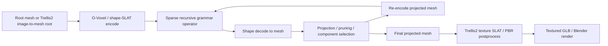

# 昨晚任务验收与方法论框架 2026-05-08 15:40

## 0. 一句话结论

昨晚到今天下午的推进已经把项目从“点云/预览级递归实验”推进到“真实 mesh-first、projection-stabilized recursive workflow、可导出 Trellis2 textured GLB、并开始覆盖非树类别”的状态。当前最有论文价值的主线不是“无限递归已经实现”，也不是“高质量纹理生成已经解决”，而是：

> **Projection-Stabilized Recursive Sparse-Latent Grammar (R-SLG)：在 Trellis2 mesh-derived O-Voxel/SLAT 稀疏 3D 状态上运行递归语法，并把 decode -> component projection -> re-encode 纳入每一层递归映射，用 frozen native 3D representation 支撑有限深度的递归 3D asset growth。**

严格说，现在还没有达到 SIGGRAPH Asia 可投级别；但已经有一条可以继续打磨成论文的方法核心。最关键缺口是：统一 baseline/metric、projection ablation 表、最终 30+ 结果矩阵、视觉质量筛选、以及更形式化的 grammar/system 叙事。

## 1. 你最关心的几个问题

### 1.1 论文状态如何？

现在有一个可工作的 ACM/SIGGRAPH 风格草稿：

`/Users/fanta/code/agent/Code/recursive_3d_generative_growth/paper_siga/main.tex`

已经完成的部分：

- 标题和主故事收束为 `Recursive Sparse-Latent Grammars for Training-Free 3D Generative Growth`。
- Abstract 已改为更严谨的版本：区分 geometric recursion quality 和 texture export compatibility，不把 texture 写成已经完全解决。
- Introduction 已明确问题边界：不是无限场景生成，不是单次 semantic 3D editing，而是 frozen sparse 3D representation 中 repeated recursive edits 的稳定性。
- Related Work 已从粗略框架扩展到：
  - L-system / IFS / DLA / space colonization；
  - Trellis / Trellis2 / modern textured 3D asset generation；
  - training-free 3D editing；
  - structure-aware 3D control；
  - branching / porous / fractal morphology metrics。
- Teaser 已换成新的非树 textured draft，而不是之前“vine/tree/DLA/portal”的偏植物草案。

还没完成的部分：

- 没有成功编译 PDF，因为本机缺 `latexmk/pdflatex/tectonic/xelatex/lualatex`。
- Results 仍然像实验状态报告，不是正式论文结果段落。
- 缺 projection quantitative table、baseline table、texture QA table、method figure。
- Related work 虽然补了引用方向，但还需要最终核查每个 bib 条目的 venue/metadata。

严格判断：论文“骨架”已经有，但还不是“稿件”。目前更像一个可信的 research scaffold，下一步必须把核心 claim 变成图表和实验。

### 1.2 有没有带纹理和最终 mesh 的版本？

有。并且这是今天最关键的突破之一。

已经跑通的事实：

- Trellis2 projected recursive OBJ mesh 已经可以走 texturing pipeline。
- `postprocess_mesh -> textured.glb` 成功。
- 本地/远端已经能渲染 GLB 预览。

代表性结果：

| 类别 | case | 状态 | 严格视觉判断 |
|---|---|---:|---|
| vine/root | `vine_d5_compete_s5_inference` | true textured GLB ok | 当前最强，可作为头图候选 |
| tree/bush | `tree_compete_s3` | true textured GLB ok | 可用，但 holes/thin sheets 明显 |
| DLA/porous | `dla_compete_s3` | true textured GLB ok | 技术成功，视觉 blocky，只适合 stress-test |
| non-tree ornament | `crown_portal_stage03` | true textured GLB ok | 类别扩展最有价值之一，碎片仍明显 |
| non-tree hard-surface | `scifi_translate_stage03` | true textured GLB ok | 证明不是植物专属，但过暗且破洞多 |
| non-tree architecture | `snow_arch_portal_stage03` | true textured GLB ok | 建筑语义可读，材质/洞仍不稳 |

新的非树 textured head draft：

![[../Assets/2026-05-08/head_figure_textured_non_tree_draft_20260508.png]]

补充：在本文写完后，第二批非树/埃舍尔 proxy 递归也完成了本地 Blender 检查：

![[../Assets/2026-05-08/non_tree_more_stage03_blender_contact_sheet.png]]

这批结果里，`ruin_arch_portal` 和 `island_city_scale_down` 比较值得继续推进；尤其 `island_city_scale_down` 是目前最接近“递归城市 / 埃舍尔式层级嵌套”的 proxy。`porous_container_compete` projection 很稳定但递归语义弱，`ornate_chair_portal` 形态有艺术感但破碎明显。

第二批非树 GLB texturing 也全部技术成功，但视觉上更暴露问题：

![[../Assets/2026-05-08/non_tree_more_textured_glb_preview_contact_sheet.png]]

严格判断：`ornate portal` 还能作为装饰类结果继续筛，`porous container` 更像单个容器而不是递归增长，`ruin arch` 和 `island city` 的 GLB 预览角度/材质把结构遮掉了，暂时不适合直接进头图。它们仍然有实验价值，因为 projection 数值稳定、非树类别明确，但最终主图要么重设相机/材质，要么重新选更适合递归语义的 root。

非树 Blender neutral render 检查：

![[../Assets/2026-05-08/non_tree_stage03_blender_contact_sheet.png]]

非树 Trellis2 textured GLB preview 检查：

![[../Assets/2026-05-08/non_tree_textured_glb_preview_contact_sheet.png]]

严格判断：现在已经不是“只有点云”。但是很多远端 preview 仍然是点/稀疏预览，不能作为论文主图。论文主图必须使用 Blender/Cycles 或 GLB-preserve-material render。当前最接近论文主图的是 vine textured GLB；非树三类目前更像“类别广度证明”和下一轮筛选起点。

### 1.3 之前工作是怎么做最终 mesh / visual 的？

从调研和已整理的 related work 角度看，几类工作通常这样处理：

- 传统图形学 procedural work：直接生成 curve/tube/mesh，并用统一 renderer 展示。优势是结构清晰、可控；弱点是材质和局部几何自然度不足。
- L-system / space colonization / DLA：通常评估 branching structure、component/connectivity、growth pattern 和 visual plausibility，很少有现代 textured asset 级材质。
- 现代 image-to-3D / text-to-3D：重点展示 textured mesh、PBR、turntable render；但通常是 one-shot object，不控制多层递归程序。
- Training-free 3D editing：重点展示 before/after、局部 preservation、mask/region edit consistency；一般不是 repeated recursive operator，也很少评估深度递归误差放大。
- Infinite/world generation：通常用 local generator + spatial composition / streaming / layouts 展示大场景，但它们的问题是 scene-scale，不是有限资产内部的递归 grammar stability。

我们的写法应该利用这些展示经验，但不要把任务说成和它们完全一样。最合理的定位是：

> 传统递归程序给结构，Trellis2 sparse 3D representation 给 mesh-derived latent substrate 和 texture/export route，projection 负责让 repeated recursive map 不崩。

## 2. 昨晚 prompt 逐条验收

| 要求 | 当前状态 | 证据/说明 | 论文处理建议 |
|---|---|---|---|
| 开完整 plan doc 并持续回写 | 完成 | 活动 plan 是 `recursive_3d_generative_growth_texture_visuals_plan_20260508.md`，已多次追加进度并镜像本地/远端 | 保持作为恢复点 |
| 最多 3 个 SSH shell、A100 文件夹低于 70GB | 完成 | 当前约 53GB，低于 70GB；本轮远端实验没有使用 `/tmp`/`/dev/shm` | 继续监控 |
| 停掉/释放 4567 并跑今晚实验 | 完成/持续 | GPUs 多次检查空闲后启动新实验；非树 root 和 texture batch 已跑完/继续跑 | 只在 plan 记录，不写论文 |
| 定下完整问题/背景/方向/故事 | 部分完成 | 主故事已收束为 Projection-Stabilized R-SLG；但理论和 method figure 还未正式化 | 主文核心 |
| baseline/metric/评估方法跑出来 | 部分完成 | 有 procedural、one-shot、direct grammar、projection 等实验线索；还缺同一视觉协议的最终 baseline table | 必补主文 |
| SIGGRAPH Asia 模板/文章骨架 | 部分完成 | `paper_siga/main.tex` 存在并持续更新；但无法本机编译 | 继续写，补编译环境 |
| Related Work 正式化 | 部分完成 | 已补 references 和 related work categories；metadata 仍需最终核对 | 主文继续打磨 |
| Intro 前面部分 | 部分完成 | 已能讲 naive bridge fails、mesh-first、frozen sparse representation | 需要更短更有力 |
| 高质量真实 mesh，不只点云 | 重大推进但未完全达标 | OBJ mesh-first 已跑通；Blender neutral render 已有；Trellis2 GLB texture export 已有 | 主图必须只用 mesh/GLB render |
| 纹理/PBR/GLB | 技术完成，视觉部分完成 | 多个 GLB ok，非树 GLB 也 ok；材质质量类别依赖很强 | 写 compatibility，不写 solved |
| 4 个不同类别头图 | 部分完成 | 新 draft 有 vine、crown、scifi、architecture；质量仍不均衡 | 继续替换弱格 |
| 30+ generated result matrix | 部分完成 | 已有 32 neutral candidate matrix，但非树占比不足；正在扩展 | 必补最终矩阵 |
| Recursive Fractal Asset Growth 主线 | 完成核心原型 | vine/root depth-5 compete 最强；tree/DLA/non-tree stage-03 已跑 | 主线 |
| tree/root/bush line | 完成基础 | tree/vine/root 多个 operator、depth、texture 已跑 | 主文/矩阵 |
| coral/crystal/porous line | 部分/偏弱 | DLA 数值稳定但视觉 blocky；新 porous_container root 已完成 | stress-test 或补新 root |
| 统一 voxel-native 3D generator 框架 | 部分完成 | R-SLG over O-Voxel/SLAT 是统一框架雏形；formal API 不够 | 最需要理论化 |
| grammar 体系兼容多种常规 grammar | 部分完成 | `compete/fork/fork_side/radial/portal/translate/scale/mirror` 等已实现；类型系统不够严谨 | 方法节核心 |
| Transform Compatibility 诊断 | 部分完成 | translate/scale/portal 可用，radial4/rotate 碎 | ablation/appendix |
| 无限递归 / 无限生长 | 未完成 | 只有有限 depth 3/5；没有 streaming/cache/LOD 实现 | future or new experiment |
| Training-free Trellis 架构利用 | 部分完成 | 用了 O-Voxel/SLAT encode/decode、texture latent、PBR export；flow repair 目前偏弱 | 继续推进 |
| NANO3D 等 training-free 方案参考 | 部分完成 | 已纳入 related work；mask/merge 思路还没变成强结果 | appendix/ablation |
| Space Colonization / spatial competition | 完成初版 | `compete` 是最稳 operator；但还缺和传统 space colonization 的公平对比 | 主 contribution 候选 |
| Pruning/projection 理论与量化 | 部分完成且最强 | component reduction 很明显；还缺系统表 | 主 contribution |
| Per-depth projection loop | 完成 | decode/project/re-encode 已是工作流核心 | 主 contribution |
| Attachment-aware grammar | 原型完成但弱 | 能降 component，但桥接几何粗糙 | appendix/limit |
| Overlap / seam blending | 部分/弱 | masked weak blend 经验有，但没有强图 | 后续 |
| root quality sweep / alpha/depth schedule | 部分完成 | texture steps 不是单调变好；root quality 很关键 | appendix/table |
| 不能做成纯工程，要有算法创新 | 方向正确但需要更形式化 | R-SLG 框架还需 formal definition、operator algebra、projection theorem/claim | 重点补 |
| 理论 DEFG / preservation-naturalization | 还未主线化 | 有概念，但未成为实验或公式 | 谨慎纳入 |
| 视频 demo / Blender 动画思考 | 未做 | 只讨论过 turntable/path；没有生成视频 | supplemental 后续 |
| 非树类别 | 新近重大推进 | crown/scifi/snow + new root queue | 继续扩展 |
| 埃舍尔风格递归 3D 艺术品 | 新需求，尚未完成 | 当前 portal/scale/island-city 是 proxy；没有 camera-aware Escher | 新支线 |

## 3. 当前已经得到的正负结论

### 3.1 正面结论

1. **Mesh-first 是正确入口。** 直接用 2D 点线/程序图像喂 Trellis2 image-conditioned generation 很容易出 sheet/fragments；mesh -> O-Voxel/SLAT encode 更适合作为递归状态。
2. **Per-depth projection 是最强稳定器。** 递归每层 decode 后都会产生碎片，如果只最后清理，碎片已经变成下一层 growth root；所以 projection 必须进递归映射。
3. **`compete` 是当前最稳 operator。** 它利用稀疏占据/排斥，天然接近 space colonization 的“空间竞争”思想。
4. **Trellis2 texture/GLB export 已经技术跑通。** 这让论文可以展示真实 GLB/textured preview，而不是只展示 OBJ 或点云。
5. **非树类别已可跑通。** crown/scifi/snow 证明方法不应只讲植物递归。

### 3.2 负面结论

1. **Full flow repair 会破坏递归拓扑。** 直接让 flow naturalize 全局状态，容易把 grammar scaffold 洗掉。
2. **更多 texture steps / 更大 texture size 不一定更好。** 已观察到 steps8/2048 不一定优于 steps2/低分辨率。
3. **DLA/porous 当前视觉弱。** 可以作为 stress-test，不适合头图 hero。
4. **Portal/transform-copy 有趣但不稳定。** 它能给出非树艺术感，但容易产生漂浮碎片。
5. **Attachment-aware bridge 不是成熟贡献。** 现在只是减少 component 的粗桥，不是高质量 seam blending。

## 4. 当前方法论框架

### 4.1 状态定义

把递归资产在深度 $d$ 的状态写成：

$$
S_d = (C_d, F_d, A_d, H_d)
$$

其中：

- $C_d \subset \mathbb{Z}^3$ 是 Trellis2 O-Voxel/SLAT sparse coordinate support；
- $F_d$ 是 shape/material latent features；
- $A_d$ 是辅助结构场，包括 occupancy、attachment、frontier、parent-child relation、component id；
- $H_d$ 是 grammar history，包括 depth、operator、随机种子、root source、projection 参数。

这个定义的关键点是：递归程序不直接操作 triangle soup，也不只操作 2D image condition，而是在 native sparse 3D latent support 上操作。

### 4.2 递归映射

当前每一层递归可以写成：

$$
\hat{S}_{d+1} = G_{\phi}(S_d; r_d)
$$

$$
M_{d+1} = D(\hat{S}_{d+1})
$$

$$
\tilde{M}_{d+1} = P_{\tau}(M_{d+1}, A_d)
$$

$$
S_{d+1} = E(\tilde{M}_{d+1})
$$

其中：

- $G_{\phi}$ 是 sparse-latent grammar operator；
- $r_d$ 是 stochastic seed / growth noise；
- $D$ 是 Trellis2 shape decoder；
- $P_{\tau}$ 是 projection/pruning operator；
- $E$ 是 Trellis2 mesh/O-Voxel/SLAT encoder。

最重要的设计点是：$P_{\tau}$ 不在最终输出后做一次，而在每层递归后做。也就是：

$$
S_{d+1} = E \circ P_{\tau} \circ D \circ G_{\phi}(S_d)
$$

这就是目前最能成立的算法贡献。

### 4.3 系统图

### 4.4 Grammar/operator 类型

当前 operators 可以分成几类：

| 类型 | 代表 operator | 图形学来源 | Trellis2 利用方式 | 当前状态 |
|---|---|---|---|---|
| Branching grammar | `fork`, `fork_side`, `continue` | L-system / tree grammar | sparse support transform + feature copy/blend | 有效果但易碎 |
| Competition growth | `compete`, `compete_fork` | space colonization / spatial exclusion | occupancy grid 自带不重复占据 | 当前最稳 |
| Frontier accretion | `radial`, `echo`, DLA variants | DLA/coral/crystal | sparse frontier attach | 数值可跑，视觉弱 |
| Transform-copy | `translate`, `mirror`, `scale`, `portal`, `radial4` | IFS/fractal/ornament | coordinate transform in sparse latent state | 非树扩展主线 |
| Projection operator | component pruning/re-encode | topology cleanup / morphology projection | decode mesh 再 encode 回 Trellis2 state | 最强贡献 |
| Naturalization | masked weak flow blend | diffusion/flow editing | 只在新坐标局部采样/混合 | 目前弱，待改 |

### 4.5 为什么这是 Trellis2-native？

这点需要在论文里写得更硬：

1. **稀疏 3D support 是一等对象。** Trellis2 的 O-Voxel/SLAT 不是普通 dense voxel grid，也不是只在 image space 做 guidance；它允许我们把 recursive support 当成可编辑的几何状态。
2. **空间竞争自然成立。** 在 sparse coordinate support 中，一个 coordinate 被占用后可以直接排斥后续 growth proposal；这比传统连续空间 attractor 更容易实现 deterministic occupancy exclusion。
3. **mesh encode/decode 形成 closed loop。** 传统 procedural mesh 没有 learned re-encoding；普通 image-to-3D generator 也不支持反复把 evolving mesh 放回 native sparse state。
4. **texture latent/export 是后端外观通道。** 当 geometry 稳定后，可以接 Trellis2 texture pipeline 导出 GLB。这不是核心理论贡献，但能显著提高展示上限。

## 5. 图形学研究者视角的严格审视

### 5.1 现在够不够发表级？

**不够。**

原因不是没有 idea，而是证据链还没闭合：

- 方法形式化还不够。现在像“我们实现了一组 operator”，还没像“一个统一 grammar system”。
- baseline 不够干净。传统算法、one-shot Trellis2、direct sparse grammar、projection loop 必须在同一 render protocol 下比较。
- metric 不够系统。component count 很强，但需要 largest-component ratio、renderability、token growth、depth stability、possibly morphology descriptors。
- 视觉质量不够稳定。vine 强，non-tree 有类别广度但 hole/sheet/fragment 明显。
- texture 只能写 compatibility，不能写主贡献。

### 5.2 但哪里有发表潜力？

有潜力的是这三点的组合：

1. **Repeated recursive edit stability** 是当前 training-free 3D editing 文献没有重点解决的问题。
2. **Projection as part of recursive map** 是很清楚的技术点，可以被公式、表格、ablation 支撑。
3. **Native sparse support grammar** 能自然统一 L-system、space competition、DLA/frontier、IFS/portal 等程序图形学概念。

如果把论文写成“高质量 3D 纹理生成”，会输给专门的 3D generation 工作；如果写成“无限递归艺术”，现在证据不足。最稳的写法是：

> 我们研究 frozen sparse 3D generator 作为 recursive graphics system substrate 时，哪些 grammar operator 能稳定迭代，projection 如何抑制误差放大，以及这种系统如何把传统递归结构带入现代 3D asset pipeline。

## 6. 对几个新方向的判断

### 6.1 埃舍尔风格递归 3D 艺术品

可以尝试，但不应马上写成主贡献。

最合理的实验设计：

- 使用 `portal` / `scale_down` / `mirror` / `rotate_z` / `translate` 作为 IFS-like transform-copy grammar。
- root 选建筑、拱门、环形 crown、island-city，而不是树。
- 加 camera-aware objective：从固定视角看形成 impossible loop / nested portal / recursive courtyard。
- 不追求全空间真实 infinite recursion，而是做 finite-depth illusion asset。

风险：

- 现在 `radial4` 和 rotate 类操作碎片多。
- Trellis2 对非欧氏/视错觉 geometry 没有天然保证。
- 如果没有 camera-aware projection，会只是“漂浮复制件”，不像 Escher。

建议定位：

- 主文可放一张 “artistic application / transform-copy recursive assets” 图；
- 方法主贡献仍然是 R-SLG + projection；
- 埃舍尔方向作为高风险高收益支线。

### 6.2 Trellis2 体素方案自带空间竞争

这是最值得继续深入的方向之一。

当前 `compete` 已经说明：稀疏 coordinate occupancy 可以天然实现 exclusion。后续应该把它形式化为：

$$
C_{new} = \{c \in \mathcal{N}(C_d) \mid O_d(c)=0,\ \rho(c) > \eta\}
$$

其中 $O_d$ 是 occupancy field，$\rho(c)$ 可以来自 attractor distance、frontier score、Trellis latent feature score 或随机 flow proposal。

要做成贡献，需要补：

- 和传统 space colonization 的对照；
- 不同 density/occupancy threshold 的 sweep；
- growth coverage vs connectedness 曲线；
- tree/root/vine 和 non-tree porous/architectural 两类都跑。

### 6.3 用 flow matching 随机采样替代传统随机生长

这是一个有潜力但当前证据偏弱的方向。

目前 full flow repair 是负结果：容易破坏 scaffold。更合理的设计不是让 flow 接管全局，而是：

1. grammar 提供候选 frontier / mask；
2. flow matching 只在候选新坐标或局部 patch 内采样；
3. projection 过滤不连通/不符合 attachment 的样本；
4. 多个 stochastic samples 中选择 component/metric 最优者。

可以写成：

$$
\hat{F}_{new}^{(k)} \sim p_{\theta}(F_{new}\mid C_d, F_d, M_{new}, I)
$$

$$
k^* = \arg\max_k Q(P_{\tau}(D(S_{d+1}^{(k)})))
$$

其中 $Q$ 是 connectedness、attachment、frontier coverage、renderability 的综合评分。

这比“传统 DLA 随机游走”更 Trellis-native，因为随机性来自 learned flow prior，而不是 hand-crafted diffusion walk。但这条线还没实验成功，不能现在写成主贡献。

### 6.4 借 training-free Trellis 方案做无限递归/无限生长

现在没有完成。可行路线有三种：

1. **Sliding-window sparse state**：只维护局部 active window，远处 bake 成 mesh/GLB chunk。
2. **LOD recursive cache**：小尺度用 already-generated motif cache，近处 re-encode/refine。
3. **Fixed-point / self-similar operator**：寻找 $S_{d+1}$ 在 scale transform 后接近 $S_d$ 的 operator，使 depth 可以视觉上延拓。

和 NANO3D / training-free edit 的联系：

- 它们的 mask/merge/preserve 思路可用于无限递归中的局部更新；
- KV/cache 或 latent cache 可减少重复生成；
- boundary repetition 可以用于 tile/chunk seam。

但这需要新实现和严格实验。当前只能写 future direction 或 appendix concept。

## 7. 下一轮最重要的推进路线

### 7.1 论文主线必须补的东西

1. **Projection quantitative table**
   - rows: root/operator/depth；
   - columns: raw components、projected components、largest component ratio、vertices/faces、re-encode success、render success。

2. **Projection ablation**
   - no projection；
   - final-only projection；
   - per-depth projection；
   - 同一 root/operator/depth 下视觉 + metric。

3. **Baseline 同协议视觉对照**
   - pure procedural；
   - one-shot Trellis2 image entry；
   - direct sparse grammar without projection；
   - projected R-SLG；
   - optional masked flow blend。

4. **最终 30+ matrix**
   - 不能只放树/藤；
   - 至少 20+ tiles 应该是 non-tree / ornament / hard-surface / architecture / porous / transform-copy；
   - 所有 tile 必须统一 camera/material/render。

5. **Method figure**
   - 不能只是一条 pipeline；
   - 必须强调 recursive loop 和 projection 是递归映射的一部分。

### 7.2 视觉路线

- 保留 vine/root 作为当前最强 hero。
- 用 crown/ornament 替代 DLA 作为头图第二类。
- 用 scifi/hard-surface 或 architecture 替代 tree 作为“非植物证明”。
- DLA/porous 降级到 stress-test row，除非找到更好 root。
- 所有 texture 图都要经过本地肉眼检查，不要直接相信 remote preview。

### 7.3 理论/系统路线

把方法从“脚本集合”升级成系统：

- typed sparse grammar；
- occupancy competition field；
- projection operator；
- stochastic local naturalization；
- recursive stability diagnostics。

可以尝试提出一个简洁的 system name，比如：

> R-SLG: Recursive Sparse-Latent Grammar

或更强调 projection：

> P-RSLG: Projection-Stabilized Recursive Sparse-Latent Grammar

## 8. 当前文件索引

主要计划：

- `AgentDoc/PROJECTS/recursive_3d_generative_growth/plans/recursive_3d_generative_growth_texture_visuals_plan_20260508.md`

论文：

- `/Users/fanta/code/agent/Code/recursive_3d_generative_growth/paper_siga/main.tex`
- `/Users/fanta/code/agent/Code/recursive_3d_generative_growth/paper_siga/references.bib`

关键视觉：

- `/Users/fanta/code/agent/Code/recursive_3d_generative_growth/visuals/non_tree_recursive_20260508/head_figure_textured_non_tree_draft_20260508.png`
- `/Users/fanta/code/agent/Code/recursive_3d_generative_growth/visuals/non_tree_recursive_20260508/non_tree_stage03_blender_contact_sheet.png`
- `/Users/fanta/code/agent/Code/recursive_3d_generative_growth/visuals/non_tree_recursive_20260508/non_tree_textured_glb_preview_contact_sheet.png`
- `/Users/fanta/code/agent/Code/recursive_3d_generative_growth/visuals/paper_quality_renders_20260508/textured_glb_preview/vine_d5_compete_tex_iso.png`

支线审计文档：

- `/Users/fanta/code/agent/Code/recursive_3d_generative_growth/docs/subagent_strict_paper_story_audit_zh_20260508.md`
- `/Users/fanta/code/agent/Code/recursive_3d_generative_growth/docs/subagent_non_tree_visual_matrix_plan_20260508.md`
- `/Users/fanta/code/agent/Code/recursive_3d_generative_growth/docs/subagent_related_work_ref_plan_20260508.md`

## 9. 最终验收判断

昨晚任务没有“完成到可投稿”，但完成了几个关键跨越：

1. 任务从点云预览转成真实 mesh-first pipeline；
2. Trellis2 texture/GLB export 从失败修到可用；
3. projection-stabilized recursion 成为清晰方法核心；
4. 结果从树/藤扩展到 crown/scifi/architecture 等非树类别；
5. 论文故事从泛泛 proposal 收束到 R-SLG；
6. 关键风险也被识别清楚：视觉不稳、baseline 不齐、theory/formalism 不够、infinite/Escher 仍是高风险支线。

我的严格建议是：接下来不要再把主线扩散成“所有递归艺术都做”，而是围绕 **P-RSLG = sparse grammar + Trellis2 state + per-depth projection** 这个核心打穿实验。埃舍尔、无限生长、flow stochastic growth 都可以继续试，但只有当它们能自然服务这个系统框架时，才应该进入主文。
