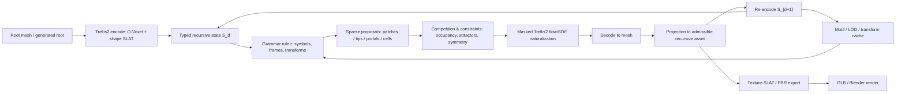

# 递归生成语法总体框架 2026-05-08 19:00

## 0. 这版文档的目的

这份文档回应现在最关键的问题：之前的 R-SLG 公式太弱，像是把 sparse coordinate copy、projection、texture export 几个工程模块串起来。要写 SIGGRAPH Asia 级别的图形学方法论文，我们需要把它上升为一个完整的 **grammar-based generative system**：

> 传统 procedural grammar 负责递归结构与可解释控制；Trellis2 这类 native sparse 3D generator 不再只是后处理器，而是 grammar 语义中的 stochastic naturalizer、局部修复器、空间竞争场、外观/PBR 生成器和可缓存的多尺度 motif prior。

因此，核心故事应从：

```text
copy sparse tokens -> decode -> prune -> texture
```

改成：

```text
typed recursive grammar program
-> sparse generative proposals
-> occupancy / attractor / symmetry constrained competition
-> masked flow/SDE naturalization in Trellis2 state
-> projection to admissible recursive asset manifold
-> re-encode and cache for the next recursive depth
```

这会让方法从“工程 pipeline”变成“生成模型参与语法语义的递归系统”。

## 1. 正式问题定义

### 1.1 输入输出

给定：

- 一个 root 资产 $x_0$，可以是 mesh、text/image-to-3D 生成的 mesh，或已有高质量 textured mesh；
- 一个递归语法程序 $\mathcal{G}$；
- 一个冻结的 native 3D generator $\mathcal{N}_\theta$，这里以 Trellis2 的 O-Voxel / shape-SLAT / texture-SLAT 为目标；
- 一个递归深度预算 $D$，或一个无限递归的局部窗口/LOD 预算；

输出：

- 有限深度：一个可渲染 mesh/GLB 资产 $x_D$；
- 多尺度展示：一组 zoom-in / level-of-detail panels；
- 可选：递归资产的程序 trace、缓存、每层 projection 统计和材质/PBR 通道。

这不是 one-shot image-to-3D，也不是传统 procedural mesh 生成。任务定义为：

> **Training-free recursive generative asset growth:** without retraining the generator, repeatedly apply a grammar-defined stochastic rewrite program inside the generator's native sparse 3D state, while preserving recursive structure and improving local asset plausibility.

### 1.2 目标函数不是单个 loss

本文不应写成“一个外部 grammar loss 去 guide diffusion”。更合理的是定义一个多约束的递归状态演化：

$$
S_{d+1} = \mathcal{T}_{\mathcal{G},\theta,d}(S_d; \xi_d),
$$

其中 $S_d$ 是递归状态，$\xi_d$ 是采样随机性。目标不是优化一个全局 loss，而是让每个递归算子满足：

1. **grammar fidelity**：保留程序规定的递归支持、拓扑意图和符号 trace；
2. **asset naturality**：在局部几何、表面、材质上落回生成模型先验；
3. **recursive stability**：小碎片、sheet、漂浮块不应在下一层变成新的生长根；
4. **renderability**：每层或最终输出可转成 mesh/GLB 并能在统一 renderer 下展示；
5. **multiscale continuity**：zoom-in 或深层递归结构能在尺度上延续，而不是每层完全重新生成。

## 2. 状态空间：Typed Sparse Generative State

把深度 $d$ 的状态定义为：

$$
S_d = (C_d, F_d, U_d, A_d, B_d, M_d, H_d).
$$

各部分含义：

| 符号 | 含义 | Trellis2 对应 | 图形学解释 |
|---|---|---|---|
| $C_d \subset \mathbb{Z}^3$ | sparse coordinate support | O-Voxel / shape-SLAT coords | 当前资产占据支撑 |
| $F_d: C_d \to \mathbb{R}^{p}$ | latent features | shape/material SLAT tokens | 局部几何/外观特征 |
| $U_d$ | typed symbols / anchors | 由 mesh/SLAT 推导 | tip、branch、patch、portal、tile、frontier |
| $A_d$ | auxiliary fields | occupancy/frontier/component | 空间竞争、吸引子、邻接、父子关系 |
| $B_d$ | boundary masks / blend kernels | masks over coords/mesh | seam、局部修复、投影边界 |
| $M_d$ | material/PBR intent | texture-SLAT / PBR voxel | base color、roughness、metallic、alpha |
| $H_d$ | history/cache | logs/cache ids | 深度、规则、随机种子、LOD、projection 参数 |

关键点：$U_d$ 和 $A_d$ 必须成为一等对象。否则我们只是操作 token 云，不是 grammar system。

## 3. 语法定义

定义生成递归语法：

$$
\mathcal{G}
=
(\Sigma,\mathcal{T},\mathcal{R},\mathcal{I},\Pi,\mathcal{P},\mathcal{N}_{\theta},\mathcal{K}).
$$

- $\Sigma$：符号类型，例如 `Tip`, `Branch`, `Patch`, `Portal`, `Tile`, `CrystalCell`, `Attractor`, `Boundary`, `MaterialSeed`。
- $\mathcal{T}$：允许的几何/尺度变换半群或群，例如 translation、rotation、scale、mirror、portal、contractive IFS maps、frame transforms。
- $\mathcal{R}$：上下文相关、随机、可带条件的规则集合。
- $\mathcal{I}$：从符号到 sparse support/features 的解释器。
- $\Pi$：竞争、对称、拓扑和边界约束。
- $\mathcal{P}$：projection 到可接受状态集合的算子。
- $\mathcal{N}_{\theta}$：冻结 Trellis2 sampler / encoder / decoder / texture naturalizer。
- $\mathcal{K}$：latent / motif / transform / LOD / KV cache。

一个规则 $r \in \mathcal{R}$ 的通用形式是：

$$
r:
X(\omega, f, s, \ell, a)
\Rightarrow
\left\{
\left(
X_j,
T_j,
\Omega_j,
q_j,
m_j,
c_j,
\tau_j,
\alpha_j,
\pi_j
\right)
\right\}_{j=1}^{k}.
$$

其中：

- $X$ 是符号类型；
- $\omega$ 是局部 frame / anchor；
- $f$ 是局部 latent patch 或统计；
- $s$ 是尺度；
- $\ell$ 是递归深度；
- $a$ 是上下文属性，例如 attractor density、frontier curvature、parent id；
- $T_j$ 是变换；
- $\Omega_j$ 是目标区域；
- $q_j$ 是 proposal distribution；
- $m_j$ 是 mask / blend kernel；
- $c_j$ 是生成模型 condition；
- $\tau_j$ 是 re-noise / flow start time；
- $\alpha_j$ 是 blend strength；
- $\pi_j$ 是局部约束，如 occupancy、symmetry、attachment。

## 4. 规则语义：从 procedural rewrite 到 generative rewrite

传统 grammar 的规则通常直接产生 geometry。我们的规则产生一个 **generative rewrite operator**：

$$
\mathcal{T}_{r,\theta}(S)
=
\mathrm{Encode}
\circ
\mathcal{P}_{r}
\circ
\mathrm{Decode}
\circ
\mathcal{N}_{\theta}^{\tau \rightarrow 0}
\circ
\mathcal{C}_{r}
\circ
\mathcal{M}_{r}
\circ
\mathcal{Q}_{r}(S).
$$

从右到左：

1. **Proposal $\mathcal{Q}_{r}$**  
   根据 symbols、frontiers、attractors 和 transforms 生成候选 sparse patches：
   $$
   \hat{Z}_r =
   \{(T_i C_i, T_{i\#}F_i, m_i, \rho_i)\}_{i=1}^{k}.
   $$

2. **Sparse merge $\mathcal{M}_{r}$**  
   把 proposal 放入当前状态：
   $$
   (\hat{C},\hat{F})
   =
   \operatorname{Merge}
   \left(
   C,F,\hat{Z}_r;
   w_{\mathrm{old}},w_{\mathrm{new}}
   \right).
   $$

3. **Competition / thinning $\mathcal{C}_{r}$**  
   对候选坐标和符号做空间竞争：
   $$
   a^*(c)
   =
   \arg\max_{a \in \mathcal{A}(c)}
   \psi(a,c;S_d),
   $$
   $$
   \psi =
   \lambda_{\mathrm{att}}\phi_{\mathrm{att}}
   -\lambda_{\mathrm{occ}}\phi_{\mathrm{occ}}
   -\lambda_{\mathrm{col}}\phi_{\mathrm{collision}}
   +\lambda_{\mathrm{front}}\phi_{\mathrm{frontier}}
   +\epsilon_{\theta}(c,\xi).
   $$
   其中 $\epsilon_{\theta}$ 可以来自 flow/SDE 采样噪声或 latent uncertainty，而不是传统算法里的人为随机数。

4. **Generative naturalization $\mathcal{N}_{\theta}^{\tau \rightarrow 0}$**  
   只在新坐标或边界窗口内运行冻结生成模型：
   $$
   dZ_t = v_{\theta}(Z_t,t,c)\,dt + g(t)\,dW_t,
   \quad
   t:\tau \rightarrow 0,
   $$
   或 rectified flow ODE:
   $$
   \frac{dZ_t}{dt}=v_{\theta}(Z_t,t,c).
   $$
   mask 语义为：
   $$
   F'(c)=
   \begin{cases}
   F(c), & c \in C_{\mathrm{old}}\setminus B,\\
   (1-\alpha)\hat{F}(c)+\alpha F_{\theta}(c), & c \in C_{\mathrm{new}}\cup B.
   \end{cases}
   $$
   这里 $\alpha$ 和 $\tau$ 是论文里应该重点实验的 schedule，而不是随便的工程参数。

5. **Decode / Projection / Re-encode**  
   $$
   \bar{x}_{d+1}=D_{\theta}(\bar{S}_{d+1}),
   $$
   $$
   x_{d+1}=\mathcal{P}_{r,\mu,\Gamma}(\bar{x}_{d+1}),
   $$
   $$
   S_{d+1}=E_{\theta}(x_{d+1}).
   $$

最终递归为：

$$
S_D =
\mathcal{T}_{r_{D-1},\theta}
\circ
\cdots
\circ
\mathcal{T}_{r_0,\theta}(S_0).
$$

这比旧公式强很多，因为生成模型采样、竞争、projection、cache 都进入了规则语义。

## 5. 可接受状态集合与 Projection

定义 admissible recursive asset set：

$$
\mathcal{A}_{\mu,\Gamma}
=
\{x:
\operatorname{comp}(x)\leq \mu_c,\;
\operatorname{attach}(x;\Gamma)\geq \mu_a,\;
\operatorname{selfint}(x)\leq \mu_i,\;
\operatorname{symerr}(x;G)\leq \mu_g
\}.
$$

Projection 不是“清理一下 mesh”，而是：

$$
\mathcal{P}_{\mu,\Gamma}(x)
=
\arg\min_{y\in\mathcal{A}_{\mu,\Gamma}}
d_{\mathrm{mesh}}(x,y)
+\lambda_s d_{\mathrm{support}}(E_\theta(x),E_\theta(y))
+\lambda_h d_{\mathrm{history}}(H_x,H_y).
$$

当前实现是这个 projection 的近似：

- connected-component filtering；
- kept largest / attached components；
- decode mesh 后重新 encode 回 Trellis2 state。

### 5.1 命题：Per-depth projection 抑制碎片递归放大

令 $f_d$ 是第 $d$ 层 decode 后 spurious components 的数量。假设每个规则在没有 projection 时会把每个 spurious component 当作 potential growth root，平均扩增率为 $\beta>1$：

$$
\mathbb{E}[f_{d+1}\mid f_d] \geq \beta f_d + \eta_d.
$$

若每层 projection $\mathcal{P}$ 最多保留 $m$ 个非主组件，并且不会删除主连通支撑，则：

$$
f_{d+1}^{\mathrm{proj}} \leq m + \eta_d',
$$

因此 $f_d$ 不再指数级积累。这里 $\eta_d'$ 是新规则引入的局部碎片。我们的 vine/tree 数据支持这个方向：raw components 可达数百/数千，但 per-depth projection 后 kept components 通常为 1-5。

### 5.2 命题：Projection 是递归语义的一部分，不是后处理

如果只在最终输出做 projection：

$$
x_D^{\mathrm{final}}
=
\mathcal{P}
\circ
D_\theta
\circ
\mathcal{T}_{D-1}
\circ\cdots\circ
\mathcal{T}_{0}(S_0),
$$

那么中间每层的 fragments 已经参与了后续 $\mathcal{T}_{d}$ 的 support proposal。per-depth projection 则是：

$$
S_{d+1}=E_\theta\circ\mathcal{P}\circ D_\theta\circ\mathcal{T}_{d}(S_d).
$$

两者不可交换：

$$
\mathcal{P}\circ \mathcal{T}_{d}
\neq
\mathcal{T}_{d}\circ\mathcal{P}.
$$

这就是为什么 projection 必须写进方法，而不能放在 appendix 说“清理了 mesh”。

## 6. 对传统方法表达能力的覆盖

### 6.1 IFS 是特殊情况

IFS 定义一组 contractive maps $\{T_i\}_{i=1}^k$，Hutchinson operator：

$$
\mathcal{H}(X)=\bigcup_i T_i(X).
$$

在我们的语法中，令：

- $\Sigma=\{\mathrm{Patch}\}$；
- rule 只产生 transform-copy proposals；
- $\mathcal{N}_{\theta}=I$；
- $\mathcal{P}=I$；
- $F$ 被忽略；

则：

$$
C_{d+1}
=
\bigcup_i T_i(C_d),
$$

即退化为 IFS。加入 $\mathcal{N}_\theta$ 后，我们得到的是 **generative IFS**：支撑遵循 IFS，但局部几何/材质由生成模型自然化。

### 6.2 L-system 是特殊情况

L-system 的核心是字符串/符号重写：

$$
\omega_{d+1}=R(\omega_d),
$$

再通过 turtle interpretation 得到几何。我们的 $U_d$ 是符号图而不是字符串，但字符串是图的一维特殊情况。令 $U_d$ 中每个 `Tip/Branch` 有 turtle frame：

$$
\omega=(p,R,s).
$$

规则：

$$
F \rightarrow F[+F]F[-F]F
$$

可写为多个 typed anchor proposals：

$$
\mathrm{Tip}(p,R,s)
\Rightarrow
\{
\mathrm{Branch}(p,R,s),
\mathrm{Tip}(p+\Delta,R R_+, \gamma s),
\mathrm{Tip}(p+\Delta,R R_-, \gamma s)
\}.
$$

因此 L-system 覆盖在 typed anchor grammar 内。区别是我们不是直接输出 cylinder/curve，而是在 Trellis2 sparse support 里解释 branch/tip。

### 6.3 Space Colonization 是 attractor-conditioned competition

Runions et al. 的 space colonization 可以写成：

$$
v_i =
\sum_{a\in A_i}
\frac{a-p_i}{\|a-p_i\|},
\quad
p_i' = p_i + \delta \frac{v_i}{\|v_i\|}.
$$

我们的 `compete` 规则可以写成：

$$
\psi(t,a)
=
-\|a-p_t\|
-\lambda_{\mathrm{occ}}\operatorname{Occ}(a)
+\lambda_{\mathrm{front}}\operatorname{Frontier}(p_t),
$$

每个 attractor 或 voxel region 由得分最高的 tip 占据，已占据坐标不能重复使用：

$$
C_{d+1}\cap C_d = \emptyset
\quad
\text{for newly accepted proposals}.
$$

这就是为什么 Trellis2 sparse voxel support 对 space competition 特别自然：occupancy 是语法状态的一部分，不需要额外连续碰撞系统。

### 6.4 DLA / frontier growth 是随机边界吸附

DLA 可看成随机游走粒子 hitting cluster boundary。我们的近似不必真的模拟所有 random walks，而是定义 frontier proposal distribution：

$$
q(c \mid C_d)
\propto
\mathbf{1}[c\in\partial C_d]\,
\exp
\left(
\lambda_h h(c)
-\lambda_o \operatorname{Occ}(c)
+\epsilon(c)
\right),
$$

其中 $h(c)$ 可以近似 harmonic measure / exposed frontier，$\epsilon(c)$ 可以来自传统随机数或生成模型 sampler noise。这样 DLA 是 stochastic FrontierAttach grammar 的特殊情况。

### 6.5 Shape grammar / CGA 是 frame/context rewrite

CGA / shape grammar 的 split、repeat、extrude、replace 可写成：

$$
\mathrm{Face}(F,\omega)
\Rightarrow
\{\mathrm{Face}(F_i,T_i\omega)\}_{i=1}^{k}.
$$

在我们的系统里，Face/Tile/Portal 是 typed symbols，$T_i$ 是局部 frame transform，解释器 $\mathcal{I}$ 把它们写入 sparse support 或用 Trellis2 root/motif patch 实例化。建筑/ornament/portal case 应该放在这里讲。

### 6.6 晶体/对称性是 group-equivariant grammar

设 $G$ 是有限对称群，如 $C_n,D_n$。如果：

1. rule set 对 $G$ 封闭：
   $$
   r(gS)=g\,r(S),\quad \forall g\in G;
   $$
2. projection 与群作用近似可交换：
   $$
   \mathcal{P}(g x)=g \mathcal{P}(x);
   $$
3. generator naturalization 在 mask 和 condition 对称时近似等变：
   $$
   \mathcal{N}_\theta(gS)\approx g\mathcal{N}_\theta(S);
   $$

则递归状态满足：

$$
S_d \approx gS_d,\quad \forall g\in G.
$$

这可以成为 crystal / radial / ornament case 的理论支撑。但目前 `radial4` 实验碎片多，暂时只能写成可探索方向；如果 crown/portal/crystal root 稳定，需要立刻把 symmetry error metric 加入主实验。

## 7. 生成模型采样如何进入算法贡献

生成模型不能只写成“最后贴纹理”。至少有三种可以写进方法的用法：

### 7.1 Stochastic growth source

传统 DLA/space colonization 的随机性来自手工采样。我们可以让随机增长方向来自 sampler uncertainty：

$$
\epsilon_\theta(c)
=
\operatorname{Var}_{\xi}
\left[
\mathcal{N}_{\theta}^{\tau\rightarrow 0}(S,c;\xi)
\right].
$$

直觉：模型对某些 frontier 的局部补全更稳定/更 plausible，则那些 frontier 更适合作为 growth proposal。

### 7.2 Local naturalization

新生长区域不是直接 copy old token，而是：

$$
F_{\mathrm{new}}
=
(1-\alpha)F_{\mathrm{grammar}}
+\alpha F_{\theta}.
$$

这解释了 alpha/depth schedule。深层递归应更保守，否则模型会洗掉 scaffold：

$$
\alpha_d=\alpha_0 \rho^d,\quad 0<\rho\leq1.
$$

### 7.3 Appearance / material grammar

material 也可以是 grammar 状态：

$$
M_{d+1}
=
\mathcal{N}^{\mathrm{tex}}_\theta
(C_{d+1},F_{d+1},m_{\mathrm{mat}},c_{\mathrm{img}}).
$$

传统 baseline 很难给出 PBR roughness/metallic/alpha；这是我们和传统方法比较时最重要的视觉优势。但当前结果还不够稳定，因此主文要谨慎：**texture-compatible and partially PBR-capable**，不是“solved photorealistic material generation”。

## 8. Cache / LOD / 无限递归

无限递归不能简单说“可以一直跑”。要定义有限内存的 streaming semantics。

设 motif cache：

$$
\mathcal{K}
=
\{(k_i,C_i,F_i,U_i,M_i,\ell_i)\}_{i=1}^{n}.
$$

当规则重复调用一个 motif transform：

$$
(C',F') = T_{\#}(C_i,F_i),
$$

不用每次从 mesh 重新 encode。对于 scale-down 递归，设尺度为 $s_d=s_0\gamma^d$。当 $s_d$ 小于渲染像素或 SLAT 分辨率阈值时，用 LOD cache：

$$
\operatorname{LOD}(d)
=
\min
\left(
L_{\max},
\left\lfloor
\log_{\gamma}(s_d/\epsilon)
\right\rfloor
\right).
$$

无限递归展示可以定义成窗口：

$$
W_t = \{c: \|Z_t(c)-p_t\| \leq R\},
$$

只对窗口内的 support 做 decode/projection/texture。这样逻辑递归深度可无限，但显存/token 是有界的：

$$
|C_d \cap W_t| \leq B_{\mathrm{tokens}}.
$$

如果这个实验能做出 zoom-in panel，就可以作为主文应用；如果只是理论，放在方法扩展或 appendix。

## 9. 实验与 claim 对应关系

| Claim | 需要证据 | 当前状态 |
|---|---|---|
| 语法覆盖传统递归程序 | IFS/L-system/space-colonization/DLA/shape grammar 的形式化映射 | 这份文档给出初稿；还需放入论文 |
| Sparse occupancy 适合空间竞争 | compete vs space colonization / direct grammar 曲线 | 只有 `compete` 正结果；缺公平 baseline |
| per-depth projection 稳定递归 | depth curve、component table、final-only projection ablation | 已有强迹象；需补 final-only/direct 对照 |
| generator sampler 可作为 stochastic growth | flow/SDE masked grid、alpha/depth schedule | 目前 weak/negative；需新实验 |
| texture/PBR 是传统方法缺口 | GLB export、PBR channels、render protocol | 技术成功；视觉质量待筛 |
| 对称/crystal/Escher/infinite 可扩展 | radial/scale/portal/symmetry error、zoom panels | proxy 有；主文还不够 |

## 10. 方法总图建议

不要画成一条普通 pipeline。应该画成“语法解释器 + 生成模型语义 + projection feedback loop”。



图里需要放四个小 callout：

1. 传统语法覆盖：IFS / L-system / space colonization / DLA。
2. Trellis2-native：sparse support + flow/SDE + texture-SLAT。
3. 稳定性：per-depth projection feedback。
4. 可扩展：cache/LOD/infinite recursion。

## 11. 文章组织建议

### 11.1 Introduction 主线

1. Procedural systems are recursive and controllable, but asset quality/material weak.
2. 3D generative models are asset-rich, but mostly one-shot and not recursive programs.
3. Naive bridges fail because recursive errors compound and full resampling erases scaffold.
4. Insight: make grammar semantics live inside native sparse 3D generative state; let generator participate locally, not globally.
5. Method: typed recursive grammar + sparse proposals + competition + masked naturalization + projection feedback + texture export.
6. Evidence: per-depth projection stability, competition operator, mesh-first GLB/textured export, category breadth.

### 11.2 Method 章节

1. Problem definition and state.
2. Grammar syntax and coverage of classical systems.
3. Generative rewrite semantics.
4. Space competition and stochastic sampler.
5. Projection-stabilized recursion with proposition.
6. Texture/material and cache extensions.

### 11.3 Experiments 章节

1. Baselines and metrics.
2. Projection ablation.
3. Space competition vs traditional space colonization / direct grammar.
4. Transform and symmetry compatibility.
5. Texture/PBR visual results.
6. Applications: recursive ring, Escher proxy, infinite city/zoom, crystal/ornament.

## 12. 当前最严格判断

能成为主文贡献的部分：

1. **形式化 recursive generative grammar framework**，如果我们把本文件发展成严谨方法节。
2. **Per-depth projection as recursive operator**，已有最强实验证据。
3. **Sparse occupancy competition**，已有最强视觉/数值起点，但必须补 space-colonization 对比曲线。
4. **Mesh-first Trellis2 recursive loop + GLB texture compatibility**，作为视觉和系统贡献。

暂时不能作为主贡献的部分：

1. Full flow repair / SDE stochastic growth：目前负面或未充分证明。
2. Infinite recursion：需要至少一个 zoom/cache demo。
3. Crystal/equivariance：需要 radial/crystal case 质量变好并有 symmetry metric。
4. Escher：目前只是 island-city/scale-down proxy，不够。
5. High-quality PBR material：技术上通，但美术质量还不够稳。

## 13. 近期最重要的执行顺序

1. 写正式理论框架到 paper method：先让故事成立。
2. Space competition 实验成体系：传统 baseline、direct/projection ablation、曲线、视觉。
3. Texture/PBR 重新选 root：高质量 textured root 或 SD3.5 guide image，优先拿到 4 个 head assets。
4. 补 final-only vs per-depth projection。
5. 做一个 cache/LOD/zoom demo，即使很小也能支撑 infinite recursion 讨论。
6. 如果 crystal/symmetry 质量不好，先不要强行写主贡献；把 transform-copy/ornament 作为 extension。

