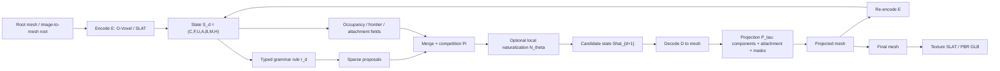

# Recursive 3D Generative Growth: Paper Outline and Figure Plan

Date: 2026-05-08

Role: paper organization and figure/methodology figure branch

Target draft: SIGGRAPH Asia style method paper

Primary constraint: this document plans the story and figures only. It does not edit `paper_siga/main.tex` or any figure assets.

## 0. Executive Decision

The current story is viable only if the paper is framed narrowly and rigorously:

> We study finite-depth recursive 3D asset growth in a frozen native 3D generative representation. The core method is a projection-stabilized recursive sparse-latent grammar: procedural grammar rules modify sparse O-Voxel/SLAT support and features, while decode -> component projection -> re-encode is treated as part of every recursive step, not as final cleanup.

The paper should not claim that it has solved infinite recursion, general Escher geometry, high-quality universal PBR generation, or arbitrary training-free 3D editing. Those are either applications, appendix diagnostics, or future work.

Recommended main name:

> Projection-Stabilized Recursive Sparse-Latent Grammar (PS-RSLG)

Shorter title can remain close to:

> Recursive Sparse-Latent Grammars for Training-Free 3D Generative Growth

The strongest narrative is not "we generate beautiful recursive assets." The stronger and more defensible narrative is:

> Repeated recursive edits inside a frozen 3D generator are unstable unless the recursive map itself includes structural projection. Sparse 3D latents make grammar rules and occupancy competition natural; projection makes them iterate.

## 1. Strict Story Audit

### 1.1 What Is Currently Strong Enough for the Main Paper

| Claim | Main-paper status | Evidence currently available | How to word it |
|---|---:|---|---|
| Mesh-first sparse state is a better substrate than 2D point/line conditioning for recursive 3D programs. | Main | Current notes record direct procedural image -> Trellis2 failures, while mesh -> O-Voxel/SLAT encode/decode works. | "We found image-conditioned procedural sketches to be unreliable, motivating a mesh-derived sparse 3D state." |
| Per-depth projection stabilizes repeated recursion better than final-only cleanup. | Main, central | Vine depth 5 and stage-3 cases show raw components collapsing to few kept components; largest-component ratios around 0.98 for vine/tree/porous and around 0.91-0.94 for several non-tree cases. | "Projection is part of the recursive operator and suppresses fragment propagation." |
| Sparse occupancy competition is the best current growth operator and naturally matches space-colonization style exclusion. | Main | `compete` is strongest current operator; vine depth-5, tree stage-3, porous container are stable. | "A sparse occupancy competition rule provides stable recursive growth across several categories." |
| The system supports finite-depth recursive asset programs across organic and selected non-organic cases. | Main, with careful visual screening | Vine/root, tree/bush, crown/ornament, scifi translate, ruin arch, island city, porous container have some successful projected meshes. | "Selected finite-depth programs across categories." Do not say "general." |
| Trellis2 GLB/PBR export is compatible with selected projected recursive meshes. | Main as secondary result or appendix table | Several true GLB exports exist, but local visual protocol says no local GLB found under repo at that audit time and material quality is category-dependent. Main.tex lists GLB successes. | "Technically compatible for selected cases; visual quality remains category-dependent." |
| The grammar framework can cover IFS, L-systems, space colonization, DLA/frontier growth, shape grammars, and symmetry grammars. | Main only as formal positioning / coverage sketch | The plan gives formal reductions, but experiments do not yet validate every family equally. | "The rule semantics subsume these families in limiting cases." Avoid implying all are equally demonstrated. |

### 1.2 Claims That Should Be Appendix or Secondary

| Claim | Recommended placement | Reason |
|---|---|---|
| Attachment-aware bridge reduces components. | Appendix / limitation | Current bridge geometry is crude; not mature enough as contribution. |
| Full flow repair / masked weak naturalization improves local geometry. | Appendix / negative result / ablation | Full flow tends to wash out topology; masked weak blend evidence is not yet strong. |
| DLA/porous/crystal family works visually. | Stress-test row / appendix | Numerically possible, but visually blocky or weak. Use for limits of frontier growth. |
| Transform-copy portal/radial/symmetry is robust. | Secondary application | Portal/translate/scale-down are promising; radial/rotate are fragile. Do not overclaim equivariance. |
| Texture/PBR quality is solved. | Appendix table or small main secondary figure only | Export success is not equal to visual/material quality. |
| 30+ generated matrix proves broad generality. | Main visual evidence only after uniform Blender/Cycles QA | Current matrix plan exists, but final uniform renders and labels are still needed. |

### 1.3 Claims That Should Be Future Work Unless New Evidence Arrives

| Claim | Why not main paper now | Future-work wording |
|---|---|---|
| Infinite recursion / unbounded growth / streaming recursion. | No implemented cache/LOD/sliding-window evidence yet. | "Extending PS-RSLG to finite-memory streaming recursion is a natural direction through motif, latent, and LOD caches." |
| Escher-style impossible geometry. | Current island-city/portal/scale-down cases are proxies, not camera-aware impossible geometry. | "Camera-aware transform-copy programs could turn this into recursive visual illusions." |
| Learned flow randomness replaces procedural stochastic growth. | Evidence weak; full flow repair is negative. | "Local masked sampler proposals could be selected by projection-based quality scores." |
| Universal non-tree coverage. | Non-tree results are uneven and often holed/dark/fragmented. | "Current results suggest non-tree potential, but category-specific roots and projection policies remain open." |

## 2. Recommended Paper Structure

This structure fits the current `main.tex` skeleton but makes the story less like an experiment log.

### Abstract

Purpose: state the gap, method, projection insight, evidence, and limitations in 6-7 sentences.

Must include:

- procedural recursion is controllable but lacks modern asset realism;
- 3D generators are rich but one-shot and unstable under repeated recursion;
- our method operates on mesh-derived sparse O-Voxel/SLAT state;
- grammar rules update support/features;
- projection is part of the recursive map;
- experiments show stability across finite-depth assets;
- texture/PBR is compatible for selected cases but not the core solved problem.

### 1. Introduction

Chinese comments that can be moved into `main.tex`:

```tex
% Intro goal:
% 1. Start from the importance of recursive structure in graphics assets.
% 2. Contrast classical procedural recursion with modern 3D generative models.
% 3. Explain the failure mode: one-shot 3D generation does not expose a stable repeated-growth state; naive global repair erases the scaffold.
% 4. Present the key insight: recursive generation should be a state operator, and projection must be inside the recursive loop.
% 5. State PS-RSLG: typed sparse grammar rules over mesh-derived O-Voxel/SLAT state, plus frozen Trellis2 decode/projection/re-encode and optional texture export.
% 6. Clearly bound the scope to finite-depth recursive assets, not infinite scenes or universal editing.
% 7. End with contributions tied to evidence: grammar formalization, projection-stabilized loop, sparse occupancy competition, and evaluated visual/metric protocol.
```

Expected length: about 1.5 pages.

Required figures nearby:

- Fig. 1 teaser/head figure: ring + multi-category assets + zoom-in insets;
- Fig. 2 method overview: recursive operator with projection inside the loop.

### 2. Related Work

Chinese comments:

```tex
% Related work should be synthesized around the paper's gap, not listed chronologically.
% Paragraph 1: Procedural recursion: L-systems, IFS, space colonization, DLA, shape grammars. Their strength is explicit structure; their weakness is asset-level geometry/material plausibility.
% Paragraph 2: Modern 3D generation and sparse latent asset models: strong one-shot assets, but limited direct control over repeated grammar execution.
% Paragraph 3: Training-free editing / local repair: useful for preservation-naturalization, but normally single-edit rather than recursive maps where errors compound.
% Paragraph 4: Structure-aware and world/infinite generation: adjacent motivation, but our task is finite-depth recursive assets and stability of repeated edits.
% Paragraph 5: Evaluation: recursive assets require connectivity, depth stability, morphology, renderability, and visual matrix evidence, not only image similarity.
```

Avoid:

- claiming prior works fail generally;
- using unverified citation metadata;
- positioning this as a new foundation model.

### 3. Problem Definition and Grammar Semantics

Chinese comments:

```tex
% Define the task before the algorithm:
% Input: root mesh or image-to-mesh root, grammar program, depth budget, optional material/texture intent.
% Output: finite-depth renderable mesh or GLB asset.
% State: S_d = (C_d, F_d, U_d, A_d, B_d, M_d, H_d).
% Grammar: G = (Sigma, Tau, R, I, P, N_theta, Pi, Caches).
% Rule format: typed symbol/frame -> transformed proposals with masks, noise, blend, and constraints.
% The important semantic distinction: grammar owns support/attachment; frozen generator provides local prior and representation, not unconstrained global resampling.
```

Main formulas:

```tex
S_d = (C_d, F_d, U_d, A_d, B_d, M_d, H_d)
```

```tex
G = (\Sigma, \Tau, R, I, P, N_\theta, \Pi, \mathcal{C})
```

```tex
r: X_i(\ell, T, s, d, a) \rightarrow
\{(X_j, T_j, m_j, q_j, \eta_j, b_j, \pi_j)\}_j
```

Coverage sketch in main body, proofs/details appendix:

- IFS: transform-copy with identity sampler and disabled projection reduces to Hutchinson iteration;
- L-system: symbolic rewriting + frame interpretation is typed anchor rewriting;
- space colonization: attractor-conditioned frontier rules + occupancy exclusion;
- DLA/frontier: stochastic frontier attachment + exclusion;
- shape grammar: contextual split/extrude/replace on frames and masks;
- symmetry: rule closure under group action plus approximately commuting projection.

### 4. Method: Projection-Stabilized Recursive Sparse-Latent Grammar

Chinese comments:

```tex
% This is the technical core. Keep it concrete.
% 4.1 Mesh-derived sparse state: encode root mesh into O-Voxel/SLAT support and features.
% 4.2 Grammar proposal: generate new sparse coordinates/features by typed operators.
% 4.3 Sparse merge and occupancy competition: old support, candidate support, exclusion, frontier scoring.
% 4.4 Local naturalization: optional masked sampler/blend only on new or boundary coordinates.
% 4.5 Projection-stabilized recursion: decode -> component projection/pruning -> re-encode before next depth.
% 4.6 Texture/export path: final stable mesh can be passed through Trellis2 texture/PBR export, evaluated separately.
```

Core recurrence:

```tex
\hat{S}_{d+1} = \mathrm{Merge}_{\Pi}
\left(S_d, \mathrm{Rule}_{r_d}(S_d), N_\theta(\cdot \mid M_d)\right)
```

```tex
M_{d+1} = D(\hat{S}_{d+1})
```

```tex
\tilde{M}_{d+1} = P_\tau(M_{d+1}; A_d, H_d)
```

```tex
S_{d+1} = E(\tilde{M}_{d+1})
```

One-line method identity:

```tex
S_{d+1} = E \circ P_\tau \circ D \circ \mathrm{Merge}_{\Pi} \circ \mathrm{Rule}_{r_d}(S_d)
```

Projection stability claim, carefully worded:

```tex
% Projection does not guarantee semantic correctness. It bounds a practical failure mode:
% small disconnected fragments are prevented from becoming new recursive roots.
```

### 5. Experiments

Chinese comments:

```tex
% The experiment section should be organized by evidence for claims, not by chronological experiments.
% 5.1 Tasks and datasets/roots: vine/root, tree/bush, transform/ornament/architecture, porous/DLA stress tests.
% 5.2 Baselines: procedural only, one-shot Trellis2, direct sparse grammar, final-only projection, full flow repair, masked weak blend, PS-RSLG.
% 5.3 Metrics: raw components, kept components, largest-component ratio, depth stability, render success, token/vertex growth, texture export success, visual QA labels.
% 5.4 Projection ablation: no projection vs final-only vs per-depth projection.
% 5.5 Space competition: compete operator curves and qualitative comparison.
% 5.6 Category breadth: uniform 30+ matrix under one Blender protocol.
% 5.7 Texture/PBR: selected GLB export quality table and renders, explicitly separate from geometry.
```

Main experiments must answer:

1. Does per-depth projection improve recursive stability?
2. Which operators are stable enough to use as method examples?
3. Does sparse occupancy competition give a credible graphics-method contribution?
4. Can the method produce selected finite-depth assets across categories?
5. Is texture export compatible without claiming solved material quality?

### 6. Analysis, Ablation, and Applications

Chinese comments:

```tex
% Use this section to make the paper honest and useful.
% Analysis: stability-expression tradeoff. Conservative compete is stable; expressive portal/radial/fork operators reveal limits.
% Ablation: projection schedule, operator type, masked flow/local naturalization, root quality, texture path.
% Applications: recursive ornament, architectural portal, island-city/Escher proxy, hard-surface transform copy.
% Keep weak applications as "illustrative" not "validated."
```

### 7. Limitations and Conclusion

Chinese comments:

```tex
% Limitations must be explicit:
% finite-depth only; no infinite streaming claim;
% projection can remove valid small structures;
% texture quality is category-dependent;
% transform/symmetry operators are not yet robust;
% roots and camera/render protocols strongly affect figure quality;
% no retraining means the method inherits Trellis2 representation biases.
% Conclusion should restate the method contribution: recursive generation as a stable state operator over sparse 3D latents.
```

## 3. Introduction Chinese Paragraph Outline

### Opening

Recursive structures are not a niche visual effect; they are a core language of 3D graphics assets. Trees, roots, vines, corals, crystals, ornaments, arches, mechanical repeats, and fractal-like cities all depend on repeated local rules over space. Classical procedural modeling gives artists and algorithms explicit control over these repeated structures, but often stops at curves, tubes, voxels, or hand-designed meshes that lack modern generated asset appearance.

### Gap

Modern 3D generative models solve the complementary problem. They can synthesize visually rich one-shot objects and textured meshes, but they usually do not expose a stable state on which a formal recursive program can be repeatedly executed. If a procedural scaffold is rendered as a 2D condition, the 3D generator often produces sheets or fragments. If a learned flow globally repairs the whole asset after each step, it tends to overwrite the very recursive topology the program was meant to preserve.

### Insight

The key insight is that recursive generation must be treated as an operator on state, not as a final cleanup problem. In a recursive loop, every small disconnected fragment can become the root of future growth. Therefore, structural projection, occupancy competition, and attachment constraints must be part of the semantics of each recursive step. Sparse 3D latents are a natural substrate for this because support coordinates, features, occupancy, frontier, and history can be edited directly.

### Method

We introduce PS-RSLG, a projection-stabilized recursive sparse-latent grammar. Starting from a mesh root, we encode it into a Trellis2-derived sparse O-Voxel/SLAT state, apply typed grammar rules to propose new support and feature updates, merge proposals through occupancy and topology constraints, decode the candidate state to a mesh, project away unstable components, and re-encode the projected mesh before the next depth. A frozen 3D generator supplies the representation and optional local naturalization/appearance path; the grammar controls recursive structure.

### Contributions

This paper contributes a grammar semantics for recursive asset growth over sparse 3D generative states, a projection-stabilized recursion operator that prevents fragment propagation, an occupancy-competition growth rule that connects space-colonization ideas with sparse latent support, and an empirical protocol for evaluating finite-depth recursive assets through stability metrics, baseline comparisons, uniform renders, and selected texture/PBR export.

## 4. Abstract: Sentence-Level Intent Draft

This is not final English. It specifies what every abstract sentence must do and what evidence it depends on.

| Sentence | Draft intent | Evidence / section dependency |
|---|---|---|
| 1 | Recursive structures are central to procedural 3D assets, but classical grammars often lack modern mesh/material plausibility. | Related Work; intro motivation. |
| 2 | Native 3D generative models produce rich one-shot objects but do not directly support stable repeated recursive programs. | Related Work; negative bridge observations. |
| 3 | We propose PS-RSLG, a training-free method that represents a recursive asset as a mesh-derived sparse O-Voxel/SLAT state and applies typed grammar rules to its support and features. | Method state/rule definition. |
| 4 | The central technical step is to insert decode -> projection -> re-encode into every recursive depth, so disconnected errors do not become future growth roots. | Projection method and ablation. |
| 5 | We instantiate the grammar with occupancy competition and transform-copy/frontier operators covering organic growth and selected non-organic recursive assets. | Operator taxonomy and visual matrix. |
| 6 | Experiments show that per-depth projection improves connectedness and depth stability over direct or final-only variants, with stable depth-5 vine/root and stage-3 tree/ornament/architecture cases. | Projection table, curves, matrix. |
| 7 | Selected projected meshes can be passed through Trellis2 texture/PBR export, but material quality remains category-dependent, so appearance is evaluated separately from recursion stability. | Texture/GLB table and limitations. |

Hard rule:

- The abstract must not say "infinite", "general-purpose", "photorealistic", or "state-of-the-art" unless new evidence appears.

## 5. Contributions Draft with Evidence Status

Recommended main-text contribution list:

1. **A recursive sparse-latent grammar formulation for finite-depth 3D asset growth.**
   - Evidence status: medium.
   - Supported by formal state/rule definitions and operator taxonomy.
   - Needs: concise formal coverage sketch and clean method figure.
   - Risk: if written too broadly, reviewers will ask for full grammar implementation coverage.

2. **A projection-stabilized recursive operator for frozen 3D generative states.**
   - Evidence status: strong.
   - Supported by component reduction and largest-component ratios in vine/tree/porous/non-tree cases.
   - Needs: no projection vs final-only vs per-depth ablation in one table/figure.
   - This should be the top contribution.

3. **A sparse occupancy competition rule for stable recursive growth.**
   - Evidence status: medium-strong.
   - Supported by `compete` being the most stable line and by depth-5 vine/root.
   - Needs: comparison against direct grammar and procedural space-colonization baseline.
   - This can become the most graphics-native algorithmic contribution if the baseline is clean.

4. **A systematic evaluation protocol for recursive generative assets.**
   - Evidence status: medium.
   - Supported by render protocol, component metrics, visual matrix plan, texture QA separation.
   - Needs: final uniform renders and complete matrix metadata.

5. **Selected texture/PBR export of projected recursive meshes through a frozen native 3D generator.**
   - Evidence status: secondary.
   - Supported by GLB successes, but quality uneven.
   - Should be worded as capability/compatibility, not a primary claim.

Contributions to avoid:

- "We solve infinite recursive 3D generation."
- "We produce high-quality textured assets across categories."
- "Our grammar robustly covers all classical recursive systems in practice."
- "Flow repair improves recursive topology."

## 6. Method Figure Plan

### 6.1 Figure Goal

The method figure must not look like a simple pipeline. It must communicate the central claim:

> Projection is inside the recursive map, and sparse support is the object edited by the grammar.

Recommended ID: Fig. 2.

### 6.2 Layout

Use a two-band figure.

Top band: one recursive loop over state.

Bottom band: operator taxonomy and concrete case thumbnails.

ASCII layout:

```text
┌──────────────────────────────────────────────────────────────────────────────┐
│ Fig. 2: Projection-Stabilized Recursive Sparse-Latent Grammar                │
├──────────────────────────────────────────────────────────────────────────────┤
│ Root mesh/image-to-mesh                                                     │
│        │                                                                     │
│        ▼                                                                     │
│  Mesh -> O-Voxel/SLAT Encode E                                               │
│        │                                                                     │
│        ▼                                                                     │
│  S_d = (C_d,F_d,U_d,A_d,B_d,M_d,H_d)                                         │
│        │                                                                     │
│        ├── Grammar Rule r_d: typed anchors, transforms, masks, proposals     │
│        │                                                                     │
│        ▼                                                                     │
│  Sparse proposals + occupancy competition + optional local naturalization    │
│        │                                                                     │
│        ▼                                                                     │
│  Candidate sparse state Ŝ_{d+1}                                               │
│        │                                                                     │
│        ▼                                                                     │
│  Decode D(Ŝ_{d+1}) -> mesh                                                    │
│        │                                                                     │
│        ▼                                                                     │
│  Projection P_tau: components, attachment, masks, support threshold          │
│        │                                                                     │
│        ├────────────── Re-encode E(P_tau(D(Ŝ))) back to S_{d+1} ───────────┐ │
│        │                                                                    │ │
│        ▼                                                                    │ │
│  Final mesh / optional texture SLAT + PBR GLB                                │ │
└──────────────────────────────────────────────────────────────────────────────┘ │
                                                                                │
Bottom strip:                                                                    │
  [IFS transform-copy] [L-system/tree] [space competition/vine] [DLA stress]     │
  [portal/ornament] [texture export path]                                        │
```

Mermaid sketch:



### 6.3 Formula Callouts Inside the Figure

Place these three equations as small callouts, not as a wall of math:

1. State:

```text
S_d = (C_d, F_d, U_d, A_d, B_d, M_d, H_d)
```

2. Recursive map:

```text
S_{d+1} = E(P_tau(D(Merge_Pi(R_d(S_d)))))
```

3. Competition:

```text
C_new = { c in N(C_d) | O_d(c)=0, rho(c)>eta }
```

### 6.4 Real Case Placement

Use real thumbnails only where they support the method:

- Root mesh thumbnail: vine/root or tree root.
- Sparse/proposal thumbnail: voxel/point support visualization if available; otherwise use simplified colored dots from actual coordinates.
- Projection thumbnail: raw fragmented mesh vs projected mesh for vine or tree, with component count labels.
- Final thumbnail: vine depth-5 compete neutral render.
- Texture side path thumbnail: small GLB render only if visually clean; otherwise use texture/PBR table icon rather than a bad render.

Do not use DLA as the primary method example. It should be a bottom-strip stress test.

### 6.5 Caption Draft

> Projection-stabilized recursive sparse-latent grammar. A root asset is encoded into a sparse O-Voxel/SLAT state. Typed grammar rules propose new support and features, which are merged through occupancy and attachment constraints and optionally locally naturalized by a frozen generator. The candidate state is decoded to a mesh, structurally projected, and re-encoded before the next recursive depth. This makes projection part of the recursive map, preventing disconnected fragments from becoming future growth roots.

## 7. Head Figure Plan: Large Ring + Multi-Category Assets + Zoom Insets

### 7.1 Purpose

The head figure should sell the paper as a graphics method with breadth, not as a single vine demo. The user's requested concept is strong:

> A large recursive ring/stage, with multiple generated asset categories placed around it, plus zoom-in insets showing recursive details.

This should be Fig. 1 / teaser.

### 7.2 Visual Composition

Recommended canvas: 16:9 wide for teaser and adaptable to `figure*` width.

Layout:

```text
┌────────────────────────────────────────────────────────────────────────────┐
│                                                                            │
│                zoom inset A: vine depth-5 detail                           │
│                       ┌──────────────┐                                     │
│                       │              │                                     │
│      asset 1          └──────┬───────┘             asset 2                 │
│   vine/root                  │                  crown/ornament             │
│        \                     │                       /                     │
│         \                    │                      /                      │
│          ┌──────────────────────────────────────────┐                      │
│          │       LARGE RECURSIVE RING / STAGE       │                      │
│          │   portal/scale-down/crown ring asset     │                      │
│          └──────────────────────────────────────────┘                      │
│         /                    │                      \                      │
│        /                     │                       \                     │
│   asset 3                    │                    asset 4                 │
│ tree/bush or arch      ┌─────┴────────┐        scifi/architecture          │
│                        │ zoom inset B │                                    │
│                        └──────────────┘                                    │
│                                                                            │
│ Bottom mini-strip: root -> grammar -> projected recursion -> optional GLB   │
└────────────────────────────────────────────────────────────────────────────┘
```

The central ring should be a real rendered asset if possible, not a decorative vector. Candidates:

1. `crown_portal_stage03` or tree portal if it reads as a ring/portal.
2. `island_city_scale_down` if it reads as nested city/ring and is re-rendered cleanly.
3. A Blender-composed torus/ring base using actual recursive asset panels placed around it only as a layout device, if no central asset is clean enough. In this fallback, the ring must be neutral and clearly a stage, not claimed as generated output.

### 7.3 Current Assets That Are Enough for Head Figure Candidates

Strong enough:

- Vine/root depth-5 compete:
  - best current geometry story;
  - strongest recursive depth evidence;
  - should be the largest or first inset.
- Tree projected compete or tree portal:
  - useful second organic/procedural category;
  - must choose camera that shows branching and hides underside holes without misleading.
- Crown portal / ornament:
  - best non-tree recursive/ornamental signal if visually legible.
- Ruin arch portal / snow arch portal:
  - architecture category; good for "not only plants."
- Scifi translate:
  - hard-surface category, but current notes say dark/holed; use only if neutral render reads clearly.
- Island city scale-down:
  - strongest Escher/infinite-city proxy, but texture preview may obscure structure. Use neutral render first.

Weak or not enough for hero:

- DLA/porous:
  - acceptable as stress-test tile, not main hero.
- Porous container:
  - numerically stable but recursive semantics weak.
- Radial4/rotate:
  - too fragmented unless a cleaner render exists.
- Full flow repair:
  - negative result, not teaser.

Missing assets / checks before final head figure:

- Uniform Blender/Cycles renders for the chosen 4 assets under the same camera/material protocol.
- At least one clean central ring/portal/stage asset.
- High-resolution close-up crops from the same render source.
- Verified GLB/PBR render for only the assets whose material does not hide topology.
- Metadata manifest: source mesh path, operator, depth, projection stats, render path.

### 7.4 Executable Blender/Layout Plan

Use Blender for renders, then assemble layout in Python/Pillow, Figma, or LaTeX only after source renders are final.

Render step:

```bash
/Applications/Blender.app/Contents/MacOS/Blender --background \
  --python /Users/fanta/code/agent/Code/recursive_3d_generative_growth/assets/blender_render_recursive_mesh.py -- \
  --out-dir /Users/fanta/code/agent/Code/recursive_3d_generative_growth/visuals/paper_quality_renders_20260508/head_ring_candidates_<hhmm> \
  --views iso front side \
  --case vine_d5_compete=/absolute/path/to/vine.obj \
  --case tree_compete=/absolute/path/to/tree.obj \
  --case crown_portal=/absolute/path/to/crown.obj \
  --case ruin_arch_portal=/absolute/path/to/arch.obj \
  --case island_city_scale_down=/absolute/path/to/island_city.obj
```

Recommended render settings:

- Use neutral material first for all assets.
- Use GLB material only after neutral render confirms geometry.
- Orthographic camera for matrix consistency.
- For teaser, render selected hero assets with transparent background if the script supports it; otherwise use consistent warm-gray background and mask carefully.
- Use at least 2400 px for teaser source tiles if feasible.

Layout assembly:

- Central ring asset: 45-55% of figure width.
- Four category assets: placed around ring as real objects, not decorative icons.
- Zoom insets: two or three, each connected by thin leader lines to a real region.
- Bottom strip: tiny method progression, optional; only if it does not crowd the image.
- Labels: category + operator + depth only, e.g. `vine/root, compete, d=5`.
- Do not put long explanatory text inside the image; reserve method explanation for caption.

Caption draft:

> Finite-depth recursive assets generated by projection-stabilized sparse-latent grammars. A central recursive portal/ring layout is surrounded by selected categories, including vine/root growth, branching tree/bush, ornament/portal transformation, and architectural or hard-surface transform-copy. Insets show recursive details from the same rendered assets. All positive panels use mesh or GLB renders; texture/PBR panels are included only where material quality preserves the underlying recursive structure.

## 8. Experiment Figure and Table Plan

### 8.1 Figure/Table Priority List

| ID | Type | Purpose | Main evidence | Priority |
|---|---|---|---|---|
| Fig. 1 | Teaser/head figure | Breadth and visual hook | 4 selected assets + ring + zoom insets | Highest |
| Fig. 2 | Method overview | Explain PS-RSLG loop | state, grammar, projection, re-encode | Highest |
| Fig. 3 | Projection ablation | Prove central claim | no projection vs final-only vs per-depth | Highest |
| Fig. 4 | Space competition | Show graphics-method operator | compete vs direct/fork/procedural baseline | High |
| Fig. 5 | Baseline comparison | Position against alternatives | procedural, one-shot Trellis2, direct grammar, full repair, PS-RSLG | High |
| Fig. 6 | 30+ visual matrix | Breadth under uniform render protocol | 4 rows x 8 tiles | High |
| Fig. 7 | Texture/PBR compatibility | Secondary appearance path | selected GLB renders + QA table | Medium |
| Fig. 8 | Applications | Ornament, architecture, island city/Escher proxy | selected clean cases | Medium |
| Table 1 | Projection metrics | Quantify stability | components, largest ratio, vertices/faces, depth | Highest |
| Table 2 | Baseline metrics | Compare methods | connectedness/renderability/depth success | High |
| Table 3 | Texture QA | Separate export from quality | GLB status, size, tokens, paper use | Medium |

### 8.2 Projection Figure

Goal:

Prove that per-depth projection is not cosmetic cleanup.

Layout:

```text
Columns:  no projection | final-only projection | per-depth projection (ours)
Rows:     vine/root compete | tree compete | portal/ornament or island-city
Below:    line chart of largest-component ratio vs depth
Right:    component count table snippet
```

Metrics:

- raw connected components;
- projected/kept connected components;
- largest-component ratio;
- vertex/face counts before/after projection;
- re-encode success;
- render success.

Caption emphasis:

> Fragments that survive intermediate depths become new growth roots. Per-depth projection suppresses this failure mode before recursion continues.

Danger:

- If final-only projection has a visually okay result for one case, explain that it cannot prevent fragment-driven growth during intermediate steps and compare depth curves, not only final image.

### 8.3 Space Competition Figure

Goal:

Turn `compete` from an implementation detail into a graphics method.

Layout:

```text
Top row:
  root -> direct grammar -> fork/fork-side -> compete (ours)

Middle row:
  occupancy/frontier visualization:
  occupied cells, candidate cells, excluded collisions, accepted growth

Bottom charts:
  largest-component ratio vs depth
  tip/frontier count vs depth
  occupancy coverage or collision violations vs depth
```

Baselines:

- traditional space colonization mesh/tube baseline;
- direct sparse grammar without competition;
- compete without projection;
- compete + per-depth projection.

Cases:

- vine/root as primary;
- tree/bush secondary;
- one non-organic or porous case only if it reads clearly.

Caption emphasis:

> Sparse O-Voxel support turns space competition into a native occupancy exclusion rule.

### 8.4 Texture/PBR Figure

Goal:

Show compatibility without overclaiming material quality.

Layout:

```text
Left: neutral geometry render (structure visible)
Right: textured GLB render (appearance path)
Rows: vine/root, tree/bush, crown/ornament, arch/scifi
Small table: GLB status, shape tokens, PBR tokens, status/use
```

Quality rule:

- If GLB material hides holes, use neutral render in main figure and move GLB to appendix.
- Do not include texture latent summaries as visual proof.
- Label this figure as "appearance compatibility" or "texture export path", not "texture quality."

### 8.5 Baseline Figure

Goal:

Show why the proposed bridge is needed.

Recommended columns:

1. Traditional procedural mesh.
2. Procedural 2D/image condition -> Trellis2.
3. One-shot Trellis2 root only.
4. Direct sparse grammar without projection.
5. Full flow repair.
6. PS-RSLG per-depth projection.

Rows:

- vine/root;
- tree/bush;
- ornament/portal or arch.

Expected story:

- procedural baseline: structure but poor local asset quality;
- image condition: sheets/fragments;
- one-shot: nice object but no recursive depth;
- direct grammar: fragmentation;
- full flow: topology washed out;
- ours: stable finite-depth recursive asset.

Risk:

- If some baselines look ugly because of poor implementation, reviewers may call it unfair. Keep baseline descriptions precise and include implementation details.

### 8.6 Applications Figure

Goal:

Show breadth after the central claims are proven.

Recommended panels:

- vine/root depth-5;
- tree/bush compete or portal;
- crown/ornament portal;
- ruin arch / snow arch portal;
- scifi translate if clean;
- island-city scale-down as Escher proxy;
- DLA/porous stress-test in a small panel only.

Do not call this "general recursive generation." Call it:

> Selected finite-depth recursive asset programs.

### 8.7 30+ Result Matrix

Goal:

Breadth under a uniform visual protocol.

Recommended rows:

1. Organic vine/root.
2. Tree/bush.
3. Transform/ornamental/architecture/hard-surface.
4. Porous/DLA/stress tests.

Alternative if non-tree assets improve:

1. Organic growth.
2. Branching structures.
3. Ornament/architecture.
4. Hard-surface/city/porous stress tests.

Metadata to keep outside the image or in caption/table:

- root family;
- operator;
- depth;
- projection status;
- GLB status;
- component stats.

Hard rule:

- Do not mix matplotlib previews with Blender/Cycles final renders.

## 9. Main-Text Claim Boundaries

Use these exact boundaries when writing:

### Safe Main-Text Wording

- "finite-depth recursive assets"
- "training-free use of a frozen native 3D generator"
- "mesh-derived sparse latent state"
- "projection-stabilized recursive map"
- "selected texture/PBR export"
- "category-dependent material quality"
- "stress-test frontier/DLA cases"
- "coverage sketch of classical grammar families"

### Unsafe Wording

- "infinite recursive generation"
- "photorealistic recursive assets"
- "general 3D grammar"
- "solves topology"
- "guarantees stable recursion"
- "state-of-the-art 3D generation"
- "universal PBR texture synthesis"
- "Escher geometry"

## 10. Most Recommended Main Story

The most defensible story is:

> PS-RSLG treats recursive 3D generation as repeated state transition in a frozen sparse 3D generative representation. Grammar rules control support, occupancy, and attachment; the generator supplies mesh-derived latent features and optional appearance; per-depth projection closes the loop by preventing component errors from propagating. This enables finite-depth recursive assets across selected organic and non-organic programs, with a clear stability-expression tradeoff.

This story matches the strongest evidence and leaves room for impressive visuals without relying on them as the only proof.

## 11. Most Dangerous Gap

The most dangerous gap is not texture quality. It is the missing clean, same-protocol ablation that proves projection is necessary.

If reviewers see only attractive final renders, they can interpret the method as engineering around Trellis2. The paper needs one undeniable central figure/table:

> no projection vs final-only projection vs per-depth projection, same root/operator/depth, with component counts, largest-component ratio, and rendered results.

Second most dangerous gap:

> baseline fairness. Traditional procedural, one-shot generator, direct sparse grammar, full flow repair, and PS-RSLG must be compared under a consistent task definition.

Third most dangerous gap:

> visual breadth. Vine/root is strong, but non-tree categories must be visually clean enough before being used to support breadth claims.

