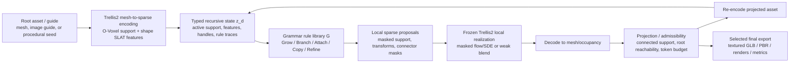

# 论文主流程图初版设计方案（PS-RSLG / Trellis2 递归语言）

创建时间：2026-05-09

## 目标

这张图应当成为论文 Method 的主图，而不是结果 gallery。它需要让图形学读者在 10 秒内读懂三件事：

1. 我们提出的是一种 **generation-model-native recursive grammar / recursive language over sparse 3D latents**。
2. Trellis2 是 frozen 3D generator substrate：提供 O-Voxel / sparse latent / decoder / encoder / masked sampler / texture path。
3. 关键区别是 **projection inside recursion**：每一层递归后都 decode -> project/admissibility -> re-encode，再进入下一层，而不是最后清理 mesh。

## 参考图风格

- TRELLIS 官方 pipeline 图：上下两条大 pipeline，模块块状清楚，颜色按功能分区，图像样例直接嵌入流程。
- Nano3D teaser：左侧输入，中央 3 个大步骤（FlowEdit / Voxel Merge / SLat Merge），右侧输出和 task examples。优点是 Trellis-based work 的模块复用读者一眼能懂。
- LATO/Trellis-based latent work：建议借鉴其“latent/token state + model module + decode/export”的视觉语法，但不要照搬 topology claim。

## 推荐总布局：两层 + 一个递归闭环

建议画成横向 `figure*`，比例约 `16:7` 或 `18:8`。不要画成 5 个并列工程框。主视觉应是中间的递归闭环。



## 画面结构

### 左侧：Inputs and Trellis2 substrate

标题：`Input and frozen Trellis2 substrate`

元素：

- 一个 root mesh 小渲染图，例如 vine/root 或 pyrite/bismuth scaffold。
- 一个 optional guide image 小卡片，标注 `appearance/material guide`。
- Trellis2 风格模块：`Mesh -> O-Voxel -> Shape SLAT`。
- 用淡蓝/淡灰方块表示 sparse voxel tokens，旁边标注：
  - `support V_d`
  - `latent features F_d`
  - `typed handles A_d`

建议文案：

> Frozen Trellis2 exposes addressable sparse 3D state.

### 中央：Recursive language / grammar core

标题：`Recursive sparse-latent language`

核心是一个大圆环或 U-shaped loop，里面分 5 个节点：

1. `Select active handles`
2. `Apply grammar rules`
3. `Emit masked sparse proposals`
4. `Local model realization`
5. `Decode -> Project -> Re-encode`

这里的重点是“语言”，所以规则库不要画成普通 checklist。建议画成一个“语法卡片”或小 DSL：

```text
h_i -> { (sigma_j, tau_j, Omega_j, m_j, kappa_j) }_{j=1}^k
```

旁边放 4 个 rule family icon：

- `Grow/Branch`：植物、根系、vine；
- `Attach/Compete`：space-colonization / porous/coral；
- `Copy/Symmetry`：crystal/pyrite/bismuth lattice；
- `Refine/Zoom`：multi-scale / depth refinement。

不要把 IFS/L-system/DLA/space-colonization 画成和我们并列的 baseline。更好是画成小的“covered classical limits”条带：

> L-system / IFS / DLA / Space colonization are restricted rule families.

这样能回应用户最关心的“grammar domain cover”。

### 中央最重要：Projection feedback

Projection 节点必须视觉上比其他节点更突出，但不要压过 grammar。建议画成一个“gate”或“filter”节点，位于 decode 后、re-encode 前：

- 输入：有一些红色小碎片 / orphan tokens。
- 输出：主 connected scaffold 继续；红色 orphan 变成 inactive descriptor 或被删除。
- 旁边小标签：
  - `root reachability`
  - `connected support`
  - `token budget`
  - `renderability`

强烈建议在这块加一个 before/after 小 inset：

```text
without projection: fragments become next handles
with per-depth projection: only admissible state recurses
```

这比纯公式更能解释论文核心。

### 右侧：Outputs and evidence slots

标题：`Finite-depth recursive assets and evidence`

右侧不是单一输出，而是三列小结果：

1. `Geometry / recursion`: neutral mesh 或 depth sequence。
2. `Texture/PBR export`: textured GLB render。
3. `Metrics`: mini chart/card，写 `LCR / components / token growth / depth`。

建议放 4 个小 case thumbnail，作为“不同阶段的 case 样例”：

- vine/root：最强主线，展示 depth 或 zoom；
- coral/porous connected scaffold：非树 frontier/attach；
- pyrite/bismuth lattice：copy/symmetry/transform；
- sci-fi/architecture module：transform-copy / hard-surface motif。

这些缩略图不要做太大，主图不是 teaser。每张只要能代表 rule family 即可。

## 颜色和视觉语言

建议颜色不要用太多 Trellis 原图里的紫/棕大块，避免和我们已有单调色问题冲突。推荐：

- Trellis2/frozen modules：淡蓝灰 `#DDEAF3`。
- Grammar/rules：淡紫 `#EFE6F4`。
- Projection/admissibility：淡绿 `#E4F1E7`，边框稍深。
- Texture/export：淡琥珀 `#F5E8D3`。
- Negative/orphan fragments：低饱和红 `#C86A5A`。
- 主线箭头：深灰 `#29313A`。

背景纯白，不要大面积渐变。所有模块使用轻圆角矩形，SVG/PPT 里易编辑。

## 建议 GPT Image 2 prompt

> Create a clean editable vector-style SVG conference-paper method figure, white background, 16:7 aspect ratio, polished SIGGRAPH-style scientific diagram. The figure explains “Projection-Stabilized Recursive Sparse-Latent Grammar” for recursive 3D asset generation with a frozen Trellis2-style 3D generator. Left panel: input root mesh / optional appearance guide, then Trellis2 mesh-to-sparse encoding into O-Voxel support and Shape-SLAT features. Center panel: a recursive language over typed sparse latent state z_d with handles, features, and rule traces. Show a grammar rule card: h_i -> { (sigma_j, tau_j, Omega_j, m_j, kappa_j) }_{j=1}^k. Around it show rule family icons: Grow/Branch, Attach/Compete, Copy/Symmetry, Refine/Zoom. Main central loop: Select handles -> Apply rules -> Masked sparse proposals -> Frozen Trellis2 local realization -> Decode to mesh -> Projection/admissibility gate -> Re-encode -> back to z_{d+1}. Make the Projection gate visually important: show small red orphan fragments removed or made inactive, while the connected green scaffold continues. Right panel: selected final exports, with four small textured 3D asset thumbnails labeled vine/root, porous coral scaffold, crystal lattice, sci-fi module; below them mini evidence cards: connected support, depth/zoom sequence, texture/PBR GLB export, metrics. Use restrained colors: blue-gray for Trellis2 frozen modules, purple for grammar rules, green for projection/admissibility, amber for export, red only for invalid fragments. Use concise labels, no long paragraphs, no decorative gradients, no dark background. Keep all shapes, arrows, labels, and thumbnails editable as separate SVG/PPT elements.

## 需要 GPT Image 2 避免的错误

- 不要把 projection 画成最后一步 cleanup；它必须在递归循环内部。
- 不要把 Trellis2 画成训练模块；标注 `frozen`。
- 不要把 texture/PBR 画成核心 topology 贡献；它只在 final/export side。
- 不要把 L-system/IFS/DLA 画成被我们击败的弱 baseline；应画成 restricted rule families 或 classical limits。
- 不要画成纯工程 pipeline；中央必须有 grammar card / rule semantics。
- 不要用 point cloud 作正式结果缩略图；缩略图必须像 mesh/textured mesh render。

## 可放入图中的真实 case 候选

从当前结果看，建议缩略图优先用：

- Vine/root depth sequence：主线最稳，可展示 recursive depth。
- Pyrite lattice 或 bismuth hopper：非树 transform-copy/symmetry candidate。
- Volumetric coral/octopus guide：frontier/attach connected scaffold candidate，但命名要保守。
- Sci-fi module/arch：hard-surface transform-copy breadth。

不要在主流程图里放 hard-DLA bridge、radial fragmented、cache-selected blocky outputs，它们只适合 boundary/diagnostic。

## 建议论文 caption 初稿

> Overview of our projection-stabilized recursive sparse-latent grammar. A root asset is encoded into a Trellis2-style sparse 3D state with support, features, and typed handles. Grammar rules emit local masked proposals for growth, attachment, transform-copy, or refinement. A frozen generator is used only for masked local realization, decoding, re-encoding, and selected texture export. The key execution step is projection inside the recursion: decoded candidates are projected to an admissible connected state before later rules can fire, preventing orphan fragments from becoming future handles. Classical procedural systems arise as restricted rule families, while selected projected states can be exported as textured GLB assets.
